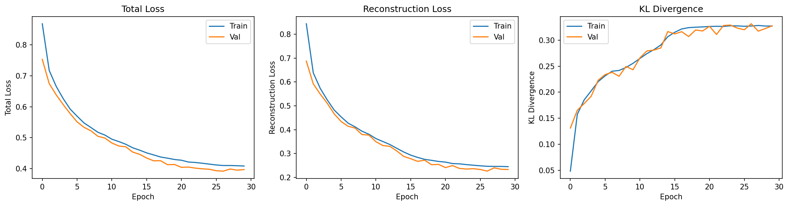

# VAE Model Training: Interpreting Loss Curves and Diagnostics

This document explains how to interpret VAE training output, diagnose common issues like posterior collapse, and understand the interplay between reconstruction and KL divergence.

---

## The ELBO Loss

VAEs maximize the Evidence Lower Bound (ELBO), or equivalently minimize the negative ELBO:

$$
\mathcal{L} = \underbrace{-\mathbb{E}_{q(z|x)}[\log p(x|z)]}_{\text{reconstruction loss}} + \underbrace{\text{KL}(q(z|x) \| p(z))}_{\text{regularization}}
$$

In practice, with a β-VAE formulation:

$$
\mathcal{L} = \mathcal{L}_{\text{recon}} + \beta \cdot \mathcal{L}_{\text{KL}}
$$

where:

- **Reconstruction loss**: How well the decoder reconstructs the input (MSE for Gaussian, NLL for NB/ZINB)
- **KL divergence**: How much the learned posterior $q(z|x)$ deviates from the prior $p(z) = \mathcal{N}(0, I)$
- **β**: Weight controlling the trade-off (β = 1 is standard VAE, β > 1 encourages disentanglement)

---

## Interpreting Training Output

A typical training log looks like:

```text
epoch 001 | train loss=0.8684 recon=0.8440 kl=0.0488 | val loss=0.7531
epoch 005 | train loss=0.5926 recon=0.4825 kl=0.2203 | val loss=0.5779
epoch 010 | train loss=0.5083 recon=0.3807 kl=0.2554 | val loss=0.4987
epoch 018 | train loss=0.4374 recon=0.2755 kl=0.3238 | val loss=0.4253
```

### What Each Metric Means

| Metric | Formula | Interpretation |
|--------|---------|----------------|
| **loss** | recon + β × kl | Total objective (lower = better) |
| **recon** | MSE or NLL | Reconstruction quality |
| **kl** | KL(q \|\| p) | Information encoded in latent space |

### Healthy Training Signs

1. **Total loss decreasing** — The model is learning
2. **Reconstruction improving** — The decoder is getting better
3. **KL increasing then stabilizing** — The latent space is being used
4. **Train ≈ Val** — No significant overfitting

---

## The KL Term: Why It Matters

### What KL Measures

The KL divergence measures how different the learned posterior $q_\phi(z|x)$ is from the prior $p(z) = \mathcal{N}(0, I)$.

$$
\text{KL}(q(z|x) \| p(z)) = \frac{1}{2} \sum_{j=1}^{d} \left( \mu_j^2 + \sigma_j^2 - \log \sigma_j^2 - 1 \right)
$$

where $\mu_j$ and $\sigma_j$ are the encoder outputs for latent dimension $j$.

### Interpreting KL Values

| KL Value | What It Means |
|----------|---------------|
| **≈ 0** | Posterior equals prior — encoder ignores input |
| **0.1 – 1.0** | Healthy range — latent encodes meaningful variation |
| **> 2.0** | Posterior far from prior — may indicate underfitting or need for higher β |

---

## Posterior Collapse: The KL ≈ 0 Problem

### What Is Posterior Collapse?

When $\text{KL}(q(z|x) \| p(z)) \approx 0$, it means:

$$
q_\phi(z|x) \approx p(z) = \mathcal{N}(0, I) \quad \text{for all } x
$$

This looks mathematically fine, but the problem is: **the encoder outputs the same distribution regardless of the input**.

### Why It's Bad

If $q(z|x) \approx \mathcal{N}(0, I)$ for all inputs:

- The encoder has learned to **ignore the input**
- Every sample maps to roughly the same latent distribution
- The latent code $z$ carries **no information about $x$**
- The latent space is **useless for downstream tasks**

### Why It Happens

The decoder becomes so powerful that it can reconstruct $x$ **without using $z$**. It essentially memorizes the data distribution.

The model finds an "easy" solution: minimize KL by setting $q(z|x) = p(z)$, and let the decoder do all the work.

### How to Detect It

| Symptom | Healthy | Collapsed |
|---------|---------|-----------|
| KL during training | Increases, then stabilizes (0.1–1.0) | Stays near 0 |
| Latent space (UMAP) | Clusters by meaningful factors | All points in one blob |
| Downstream classification | Good accuracy | Near random |

### How to Fix It

1. **Lower β** — Reduce KL penalty (e.g., β = 0.1 or 0.5)
2. **KL annealing** — Start with β = 0, gradually increase
3. **Free bits** — Allow minimum KL per dimension before penalizing
4. **Weaker decoder** — Reduce decoder capacity
5. **Cyclical annealing** — Periodically reset β to 0

---

## The β Parameter

### Effect of Different β Values

| β Value | Effect |
|---------|--------|
| **β < 1** | Prioritize reconstruction, allow higher KL |
| **β = 1** | Standard VAE (balanced) |
| **β > 1** | Prioritize regularization, encourage disentanglement |

### Practical Guidance

- **Start with β = 0.5** for gene expression data
- If KL stays near 0, reduce β further
- If reconstruction is poor, reduce β
- If latent space is unstructured, increase β

---

## KL Annealing

A common technique to avoid posterior collapse:

```python
def kl_annealing_schedule(epoch, warmup_epochs=10, max_beta=1.0):
    """Linear KL annealing."""
    return min(max_beta, max_beta * epoch / warmup_epochs)
```

This allows the model to first learn good reconstructions, then gradually enforce the prior constraint.

---

## Example: Healthy Training Curves

The figure below shows training curves from a cVAE trained on synthetic bulk RNA-seq data (`examples/01_bulk_cvae.ipynb`):



**What to observe:**

- **Total Loss** (left): Both train and val decrease smoothly, converging together
- **Reconstruction Loss** (center): Decreases rapidly early, then plateaus — the decoder is learning
- **KL Divergence** (right): Increases from ~0.05 to ~0.32, then stabilizes — the latent space is being used

This is a textbook example of healthy VAE training: good reconstruction, no posterior collapse, no overfitting.

---

## Example: Diagnosing Your Training

Given this output:

```text
epoch 001 | recon=0.84 kl=0.05
epoch 010 | recon=0.38 kl=0.26
epoch 018 | recon=0.28 kl=0.32
```

**Diagnosis:**

- ✅ Reconstruction improving (0.84 → 0.28)
- ✅ KL increasing (0.05 → 0.32) — latent space is being used
- ✅ KL in healthy range (0.1–1.0)
- ✅ No posterior collapse

**Conclusion:** Training is healthy. The model is learning meaningful latent representations.

---

## Summary

| Metric | Want to See | Red Flag |
|--------|-------------|----------|
| **Total loss** | Decreasing, train ≈ val | Diverging train/val |
| **Reconstruction** | Decreasing | Stuck high |
| **KL** | Increases then stabilizes (0.1–1.0) | Stays near 0 |

The key insight: **KL ≈ 0 means the latent space is useless**, even though it technically satisfies the prior constraint. A healthy VAE has moderate KL, indicating the encoder is learning to compress input-specific information into the latent space.
