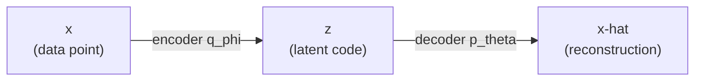
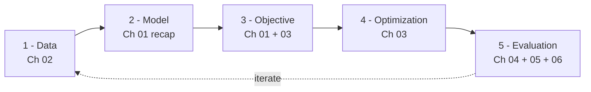
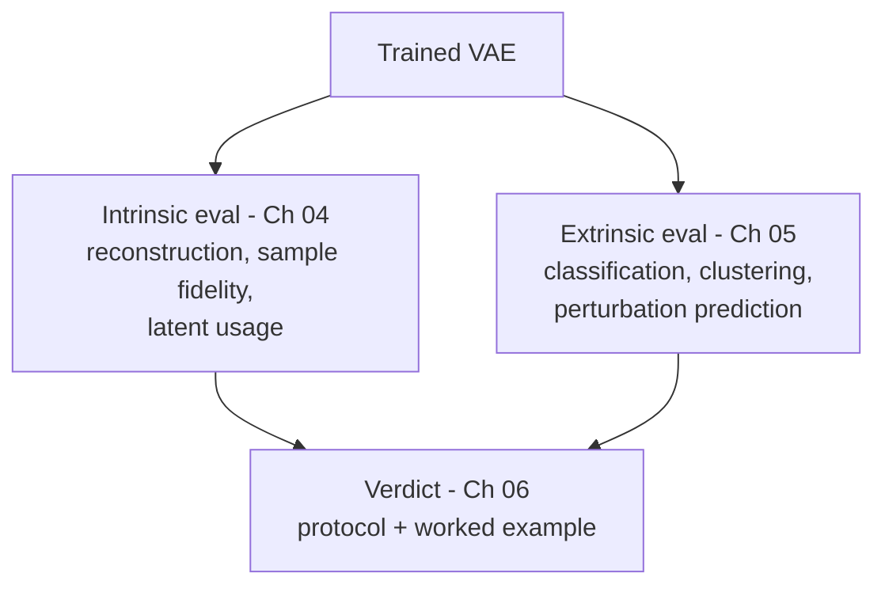

# Chapter 01 — Introduction: What It Means to Train a VAE

Before we touch a single line of training code, let's get our bearings. This
chapter builds the map that the rest of the series fills in. By the end you
should be able to say, in plain language, what happens when someone says
"I trained a VAE" — and you should know what each of the next five chapters is
for.

We assume only that you know what a neural network is (a function with tunable
weights), what a loss function is (a number that says how wrong the model is),
and what gradient descent does (nudge the weights to make that number smaller).
Everything else we build up gently.

---

## 1. A two-minute recap: what a VAE *is*

A **Variational Autoencoder (VAE)** is a model that learns to do two things at
once:

1. **Compress** each data point into a small, well-organized summary.
2. **Generate** new, realistic data points by sampling from that summary space.

It has two halves, and they have names worth memorizing because we use them on
every page from here on:

- The **encoder**, written $q_\phi(z \mid x)$. It reads a data point $x$ and
  produces a *distribution* over a short summary vector $z$. The symbol $\phi$
  (phi) stands for the encoder's weights.
- The **decoder**, written $p_\theta(x \mid z)$. It reads a summary $z$ and
  produces a *distribution* over reconstructed data $x$. The symbol $\theta$
  (theta) stands for the decoder's weights.

Let's name every symbol so nothing is mysterious:

- $x$ — one **data point** (in our running example, one cell's gene-expression
  vector).
- $z$ — the **latent code**: a short vector summarizing $x$. "Latent" just means
  "hidden / not directly observed." If $x$ has 2000 numbers, $z$ might have 10.
- $\phi$ — the **encoder weights** (what we learn for the encoder).
- $\theta$ — the **decoder weights** (what we learn for the decoder).
- $q_\phi(z \mid x)$ — read aloud as "q-phi of z given x": the distribution the
  encoder assigns to $z$ after seeing $x$.
- $p_\theta(x \mid z)$ — "p-theta of x given z": the distribution the decoder
  assigns to $x$ after seeing $z$.

Here is the whole object in one picture:

A crucial detail that separates a VAE from an ordinary autoencoder: the encoder
does **not** output a single $z$. It outputs the *parameters of a distribution*
over $z$ — usually a mean vector $\mu$ (mu) and a spread vector $\sigma$ (sigma)
— and then we *sample* $z$ from that distribution:

$$
q_\phi(z \mid x) = \mathcal{N}(\mu(x), \mathrm{diag}(\sigma^2(x)))
$$

Reading this: the encoder turns $x$ into a mean $\mu(x)$ and a standard deviation
$\sigma(x)$, and $z$ is drawn from a **normal (Gaussian) distribution**
$\mathcal{N}$ with that mean and a diagonal covariance (the $\mathrm{diag}$ part
just means the latent dimensions are treated as independent, each with its own
variance $\sigma^2$). If the word "Gaussian" is hazy: it's the classic bell
curve, fully described by where its center is ($\mu$) and how wide it is
($\sigma$).

> **Why a distribution and not a point?** Because we want to *generate* later. If
> every $x$ maps to a fuzzy cloud in $z$-space rather than a single dot, those
> clouds overlap and fill the space smoothly — so when we sample a new $z$ and
> decode it, we get something realistic instead of nonsense. The full argument
> is in [VAE-01](../VAE-01-overview.md); for now, just hold onto "the encoder
> outputs a cloud, not a dot."

---

## 2. The objective: one equation the whole training rests on

Training means **adjusting $\phi$ and $\theta$ so the model gets good**. We need
a way to quantify what "good" is, which has to be a number we can minimize. For a
VAE that number comes from the **ELBO (Evidence Lower Bound)**. We will not re-derive it here — that's
[VAE-02](../VAE-02-elbo.md)'s job — but we need to recognize its two pieces,
because every training log you'll ever read reports them separately.

The training loss is the **negative ELBO**:

$$
\mathcal{L} = \underbrace{-\mathbb{E}_{q_\phi(z \mid x)}[\log p_\theta(x \mid z)]}_{\text{reconstruction loss}} + \underbrace{\text{KL}(q_\phi(z \mid x) \| p(z))}_{\text{regularization}}
$$

Two terms, two jobs. Let's define the new symbols:

- $\mathcal{L}$ — the **loss** we minimize (lower is better).
- $\mathbb{E}_{q_\phi(z \mid x)}[\cdot]$ — an **expectation** (an average) taken
  over latent codes $z$ drawn from the encoder. In practice we approximate it by
  sampling a $z$ and evaluating the thing in brackets.
- $\log p_\theta(x \mid z)$ — the **log-likelihood** of the real data point $x$
  under the decoder's distribution. Bigger means "the decoder finds the true $x$
  very plausible." We negate it so that *small loss = good reconstruction*.
- $p(z)$ — the **prior**: the distribution we *wish* the latent codes followed,
  before seeing any data. Almost always the standard normal
  $\mathcal{N}(0, I)$ — centered at zero, unit spread, dimensions independent
  (the $I$ is the identity matrix).
- $\text{KL}(q \| p)$ — the **Kullback–Leibler divergence**, a number measuring
  how far the encoder's cloud $q_\phi(z \mid x)$ is from the prior $p(z)$. It is
  zero when they match and grows as they diverge.

In words:

- The **reconstruction** term pushes the model to *rebuild the input faithfully*
  — the decoder should make the real $x$ look likely.
- The **regularization** term pushes the encoder's clouds to *stay near the
  prior* — so the latent space stays smooth and samplable, instead of scattering
  each point off to its own private corner.

Training is the tug-of-war between these two. That tension is the source of both
the VAE's power and its most famous failure mode (posterior collapse), which we
meet in Chapter 03.

### Where did $q_\phi(z \mid x)$ come from, and why is it everywhere?

Notice that the encoder distribution $q_\phi(z \mid x)$ appears in *both* terms
of the loss — we average the reconstruction over it, and we measure the KL *of*
it. That is not a coincidence; it's the whole trick that makes a VAE trainable.
It's worth understanding where this object comes from, because it's the single
cleverest idea in the model.

Here is the problem it solves. What we *truly* want is for the model to assign
high probability to real data — to make $p_\theta(x)$, the overall likelihood of
a data point, large. To compute that likelihood you would have to account for
*every* latent code that could have produced $x$:

$$
p_\theta(x) = \int p_\theta(x \mid z) p(z) \mathrm{d}z
$$

Define the new piece: that $\int \cdots dz$ is an **integral over the entire
latent space** — a sum over infinitely many possible $z$ values. For any real
neural-network decoder this integral has no closed form and is hopeless to
compute directly. Relatedly, the *true* posterior $p_\theta(z \mid x)$ — "given
this $x$, which latent codes were plausibly responsible?" — is equally
intractable, because by Bayes' rule it needs that same impossible integral in its
denominator.

The variational idea is to **stop trying to compute the impossible thing and
instead learn a cheap stand-in for it**. We introduce a second network, the
encoder $q_\phi(z \mid x)$, whose only job is to *approximate* that intractable
true posterior:

$$
q_\phi(z \mid x) \approx p_\theta(z \mid x)
$$

The encoder is a guess at "which $z$ explains this $x$" — but a guess we can
actually evaluate and sample from, because we chose its form (a Gaussian) to be
friendly. Once you commit to this stand-in, a short derivation (the one in
[VAE-02](../VAE-02-elbo.md)) turns the impossible likelihood into the ELBO — the
two-term loss above — which is a genuine *lower bound* on $\log p_\theta(x)$. The
word "Bound" in "Evidence Lower Bound" is exactly this: we cannot reach the true
quantity, so we optimize a floor underneath it, and pushing the floor up drags
the real thing up with it.

That is why $q_\phi$ shows up twice. It is doing two jobs simultaneously:

- in the **reconstruction** term, it tells us *which* $z$ to sample and feed the
  decoder (you can't reconstruct from a latent code without first proposing one);
- in the **KL** term, it is the very thing being kept honest — pulled toward the
  prior $p(z)$ so our approximation stays well-behaved and the latent space stays
  smooth.

So the encoder is not a bolt-on convenience. It is the device that converts an
intractable goal ("maximize the data likelihood") into a tractable one
("maximize the ELBO"). Hold onto this intuition — it's the same move that
underlies diffusion models and many other latent-variable methods we'll meet
later in the project. The full mechanics are in [VAE-02](../VAE-02-elbo.md) and
[VAE-03](../VAE-03-inference.md); here we just want the *why*.

> **A small but important worked detail.** Suppose for one cell, in a
> 2-dimensional latent space, the encoder outputs mean $\mu = (0.3, -0.1)$ and
> spread $\sigma = (0.9, 1.1)$. The KL term comparing this Gaussian to the
> standard normal has a closed form (derived in Chapter 03):
>
> $$\text{KL} = \frac{1}{2} \sum_{j} \left( \mu_j^2 + \sigma_j^2 - \log \sigma_j^2 - 1 \right)$$
>
> Work the two latent dimensions one at a time.
>
> **Dimension $j = 1$**, with $\mu_1 = 0.3$ and $\sigma_1 = 0.9$:
>
> $$\mu_1^2 + \sigma_1^2 - \log \sigma_1^2 - 1 = 0.09 + 0.81 - \log(0.81) - 1 = 0.09 + 0.81 + 0.21 - 1 = 0.11$$
>
> **Dimension $j = 2$**, with $\mu_2 = -0.1$ and $\sigma_2 = 1.1$:
>
> $$\mu_2^2 + \sigma_2^2 - \log \sigma_2^2 - 1 = 0.01 + 1.21 - \log(1.21) - 1 = 0.01 + 1.21 - 0.19 - 1 = 0.03$$
>
> **Combine** the two dimensions and apply the leading $\frac{1}{2}$:
>
> $$\text{KL} = \frac{1}{2}(0.11 + 0.03) \approx 0.07$$
>
> A small, healthy number — meaning this cell's cloud sits close to the prior. We
> will read exactly these numbers off real training logs in Chapter 03.

---

## 3. The five stages of training (the spine of this series)

Now the map. Training a VAE — or honestly almost any model — moves through five
stages. Each chapter of this series is one of them.

1. **Data.** Decide what $x$ is, and prepare it correctly. For gene-expression
   counts this is subtle enough to deserve its own chapter — and it's where VAEs,
   diffusion models, and flow-matching models quietly disagree about what they
   want. That's **Chapter 02**.
2. **Model.** Choose the encoder and decoder architectures, the latent size, and
   crucially the *decoder's distribution* (Gaussian? Negative-Binomial?). We met
   the pieces above; the count-specific choices come back in Chapter 02.
3. **Objective.** The negative ELBO from Section 2. The only thing we'll add
   later is a knob, $\beta$, that reweights the two terms.
4. **Optimization.** The actual loop: feed batches, compute the loss, backpropagate,
   update $\phi$ and $\theta$, repeat for many epochs — while watching for
   trouble. That's **Chapter 03**.
5. **Evaluation.** The stage people skip and regret. It splits cleanly in two,
   which is why it gets two chapters.

The dashed "iterate" arrow matters: evaluation feeds back into data and model
choices. Training is a loop, not a straight line.

---

## 4. What does success look like? Two very different questions

Here's a trap worth naming on day one. A VAE can have a *beautiful, smoothly
decreasing loss curve and still be useless.* So "did it work?" is not one
question — it's two, and they are genuinely independent.

**Intrinsic evaluation — is the model good on its own terms?**
Does it reconstruct held-out data accurately? Does it generate samples whose
statistics match real data? Is it actually *using* its latent space? These
questions live entirely inside the model's own world. This is **Chapter 04** —
and it's where we confront a question you might already be asking: *isn't FID
the standard generative metric?* (Short answer, unpacked there: FID is built for
images and does not transfer to gene expression — there's a better toolbox.)

**Extrinsic evaluation — is the representation useful for something else?**
Take the learned latent codes $z$ and try to do a real downstream job with them:
classify each cell's type, cluster cells into known groups, predict a
perturbation response. A representation can reconstruct well yet be useless for
these — or vice versa. This is **Chapter 05**.

Holding both questions in mind from the start is the single most important habit
this series tries to build. A loss curve is necessary, never sufficient.

---

## 5. Our running example, seeded

Throughout, we train one concrete model so the abstractions always have a body:

- **Data ($x$):** PBMC single-cell RNA-seq — each $x$ is one immune cell's
  vector of gene-expression **counts** (how many times each gene's RNA was
  detected). A few thousand cells; we'll work with a reduced gene set.
- **Model:** `CVAE_NB` — a **C**onditional VAE whose decoder uses a
  **N**egative-**B**inomial distribution, the right choice for count data
  (Chapter 02 explains why raw counts and NB go together). "Conditional" means we
  also feed in a covariate, like batch or cell type; the "C" changes nothing
  about the encoder/decoder story above.
- **The label we hold back:** each cell's known **cell type**. We do *not* let
  the model see it during training — we save it to test, in Chapter 05, whether
  the latent codes $z$ secretly learned to separate cell types on their own.

You'll also be able to *run* this. The series ships size-configurable scripts and
notebooks (`examples/vae/training/`, `notebooks/vae/training/`) that go from a
seconds-long laptop smoke test to a full GPU-pod run by changing one config
value — the mechanics are in Chapter 03.

---

## Recap, and what's next

What we established:

- A VAE is an **encoder** $q_\phi(z \mid x)$ (data to a *cloud* in latent space)
  plus a **decoder** $p_\theta(x \mid z)$ (latent back to data).
- Training minimizes the **negative ELBO** = **reconstruction** loss +
  **KL regularization**, a tug-of-war between rebuilding the input and keeping
  the latent space smooth.
- Training moves through five stages — **data, model, objective, optimization,
  evaluation** — and this series is one chapter per stage.
- "Did it work?" is two independent questions: **intrinsic** (good on its own
  terms) and **extrinsic** (useful downstream). A nice loss curve answers
  neither by itself.

Next, **[Chapter 02 — Datasets](02-datasets.md)**: what the training data
actually looks like, why count data forces specific choices, and the question you
asked at the outset — do diffusion and flow-matching models want the *same* data
a VAE does? (They mostly share the raw material and disagree about the
preparation, and the reason why is genuinely illuminating.)
