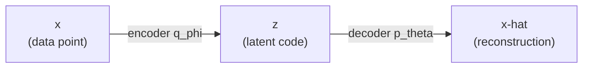
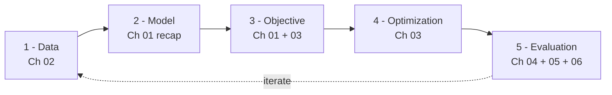
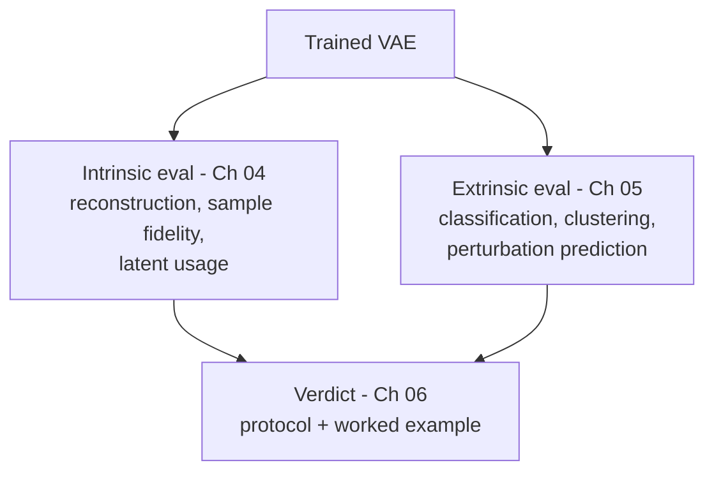

# Chapter 01 — Introduction: What It Means to Train a VAE

*The starting point. No background beyond basic ML assumed — if you know what a
neural network, a loss function, and gradient descent are, you have enough.*

Before we touch a line of training code, let's get our bearings. This chapter
builds the map that the rest of the series fills in. By the end you should be
able to say, in plain language, what happens when someone says "I trained a VAE,"
and you should know what each of the next chapters is for. Every symbol that
appears here also lives in the [notation reference](notation.md), collected in
one place — but you won't need to leave the page to follow along.

## A two-minute recap: what a VAE is

A **Variational Autoencoder (VAE)** learns to do two things at once: to *compress*
each data point into a short, well-organized summary, and to *generate* new,
realistic data points by sampling from the space of those summaries. It has two
halves, and their names recur on every page from here on. The **encoder**,
written $q_\phi(z \mid x)$, reads a data point $x$ and produces a distribution
over a short summary vector $z$; the subscript $\phi$ ("phi") stands for the
encoder's weights. The **decoder**, written $p_\theta(x \mid z)$, reads a summary
$z$ and produces a distribution over reconstructed data $x$; the subscript
$\theta$ ("theta") stands for the decoder's weights.

It is worth naming each symbol as it stands, so nothing is mysterious. The data
point $x$ is, in our running example, one cell's vector of gene-expression
counts. The latent code $z$ is a short vector summarizing $x$ — "latent" just
means "hidden, not directly observed," and if $x$ has 2000 numbers then $z$ might
have 10. The whole object is just two networks chained together:

The one detail that separates a VAE from an ordinary autoencoder is that the
encoder does *not* output a single $z$. It outputs the parameters of a
distribution over $z$ — a mean vector $\mu(x)$ and a spread vector $\sigma(x)$ —
and then we *sample* $z$ from it: $q_\phi(z \mid x) = \mathcal{N}(\mu(x), \mathrm{diag}(\sigma^2(x)))$.
Reading that aloud: the encoder turns $x$ into a mean $\mu(x)$ and a standard
deviation $\sigma(x)$, and $z$ is drawn from a **Gaussian** (the classic bell
curve, fully described by where it's centered, $\mu$, and how wide it is,
$\sigma$) whose dimensions are treated as independent — that is all the
$\mathrm{diag}$ means.

Why a distribution and not a point? Because we want to *generate* later. If every
$x$ maps to a fuzzy cloud in $z$-space rather than a single dot, those clouds
overlap and fill the space smoothly, so when we sample a new $z$ and decode it we
get something realistic instead of nonsense. The full argument is in
[VAE-01](../VAE-01-overview.md); for now, just hold onto "the encoder outputs a
cloud, not a dot."

## The objective: one equation the whole thing rests on

Training means adjusting $\phi$ and $\theta$ so the model gets better at explaining
the observed data. We therefore need a numerical objective that tells us how "good"
the model is, and that objective should be something we can minimize. For a VAE that
number is the negative **ELBO (Evidence Lower Bound)**. We won't
re-derive it here; that is [VAE-02](../VAE-02-elbo.md)'s job. But we need to
recognize its two pieces, because every training log you'll ever read reports
them separately:

$$
\mathcal{L} = \underbrace{-\mathbb{E}_{q_\phi(z \mid x)}[\log p_\theta(x \mid z)]}_{\text{reconstruction loss}} + \underbrace{\text{KL}(q_\phi(z \mid x) \| p(z))}_{\text{regularization}}
$$

Two terms, two jobs. The **reconstruction** term contains $\log p_\theta(x \mid z)$,
the decoder's log-likelihood of the real data point — bigger when the decoder
finds the true $x$ very plausible, and we negate it so that small loss means good
reconstruction. The expectation $\mathbb{E}_{q_\phi(z \mid x)}[\cdot]$ is just an
average over latent codes drawn from the encoder, which in practice we
approximate by sampling a $z$ and evaluating the term inside. The
**regularization** term is the Kullback–Leibler divergence
$\text{KL}(q \| p)$, a number measuring how far the encoder's cloud
$q_\phi(z \mid x)$ sits from the **prior** $p(z)$ — the distribution we *wish* the
latent codes followed, almost always the standard normal $\mathcal{N}(0, I)$ (the
$I$ is the identity matrix). The KL is zero when the two match and grows as they
diverge.

So in words: the reconstruction term pushes the model to rebuild the input
faithfully, while the regularization term pushes the encoder's clouds to stay
near the prior, keeping the latent space smooth and samplable instead of letting
each point scatter off to its own private corner. Training is the tug-of-war
between these two, and that tension is the source of both the VAE's power and its
most famous failure mode (posterior collapse, which we meet in Chapter 03).

A quick worked number makes the KL concrete. Suppose for one cell, in a
2-dimensional latent space, the encoder outputs $\mu = (0.3, -0.1)$ and
$\sigma = (0.9, 1.1)$. The Gaussian-versus-standard-normal KL has the closed form
$\frac{1}{2} \sum_j (\mu_j^2 + \sigma_j^2 - \log \sigma_j^2 - 1)$ (derived in
[Chapter 03](03-the-training-loop.md)). Work the two dimensions one at a time. The
first dimension ($j=1$), with $\mu_1 = 0.3$ and $\sigma_1 = 0.9$, contributes

$$
\mu_1^2 + \sigma_1^2 - \log \sigma_1^2 - 1 = 0.09 + 0.81 + 0.21 - 1 = 0.11
$$

and the second ($j=2$), with $\mu_2 = -0.1$ and $\sigma_2 = 1.1$, contributes

$$
\mu_2^2 + \sigma_2^2 - \log \sigma_2^2 - 1 = 0.01 + 1.21 - 0.19 - 1 = 0.03
$$

so the KL for this cell is $\frac{1}{2}(0.11 + 0.03) \approx 0.07$ — a small,
healthy number meaning this cell's cloud sits close to the prior. We'll read
exactly these quantities off real training logs in
[Chapter 03](03-the-training-loop.md).

### Where did $q_\phi(z \mid x)$ come from, and why is it everywhere?

Notice that the encoder distribution appears in *both* terms of the loss — we
average the reconstruction over it, and we measure the KL *of* it. That is no
coincidence; it's the whole trick that makes a VAE trainable, and it's the single
cleverest idea in the model.

Here is the problem it solves. What we truly want is for the model to assign high
probability to real data — to make $p_\theta(x)$, the overall likelihood of a
data point, large. But computing that likelihood means accounting for *every*
latent code that could have produced $x$, an integral over the entire latent
space, $p_\theta(x) = \int p_\theta(x \mid z) p(z) \mathrm{d}z$, which for any
real neural-network decoder has no closed form and is hopeless to compute
directly. The *true* posterior $p_\theta(z \mid x)$ — "given this $x$, which
latent codes were plausibly responsible?" — is equally intractable, since by
Bayes' rule it needs that same impossible integral.

The variational idea is to stop trying to compute the impossible thing and learn
a cheap stand-in for it instead. We introduce a second network, the encoder
$q_\phi(z \mid x)$, whose only job is to *approximate* the true posterior:
$q_\phi(z \mid x) \approx p_\theta(z \mid x)$. The encoder is a guess at "which
$z$ explains this $x$" — but a guess we can actually sample from and evaluate,
because we chose its form (a Gaussian) to be friendly. Once you commit to this
stand-in, a short derivation (the one in [VAE-02](../VAE-02-elbo.md)) turns the
impossible likelihood into the ELBO, a genuine *lower bound* on
$\log p_\theta(x)$. That is exactly the "Bound" in "Evidence Lower Bound": we
cannot reach the true quantity, so we optimize a floor underneath it, and pushing
the floor up drags the real thing up with it.

That is why $q_\phi$ shows up twice — it is doing two jobs at once. In the
reconstruction term it tells us *which* $z$ to sample and feed the decoder (you
can't reconstruct from a latent without first proposing one); in the KL term it
is the thing being kept honest, pulled toward the prior so the approximation
stays well-behaved and the latent space stays smooth. So the encoder is not a
bolt-on convenience — it is the device that converts an intractable goal
("maximize the data likelihood") into a tractable one ("maximize the ELBO"). This
same move underlies diffusion models and many other latent-variable methods we'll
meet later; the full mechanics are in [VAE-02](../VAE-02-elbo.md) and
[VAE-03](../VAE-03-inference.md).

## The five stages of training

Now the map. Training a VAE — like almost any model — moves through five stages,
and each chapter of this series is one of them.

The **data** stage decides what $x$ is and prepares it correctly; for
gene-expression counts this is subtle enough to fill [Chapter 02](02-datasets.md), and it's where
VAEs, diffusion, and flow-matching models quietly disagree about what they want.
The **model** stage chooses the encoder and decoder architectures, the latent
size, and crucially the decoder's distribution — Gaussian, or Negative-Binomial
for counts. The **objective** is the negative ELBO above, to which Chapter 03
adds a single knob, $\beta$, that reweights the two terms. The **optimization**
stage is the actual loop — feed batches, compute the loss, backpropagate, update
$\phi$ and $\theta$, repeat, while watching for trouble — and that is Chapter 03.
Finally the **evaluation** stage is the one people skip and regret; it splits in
two, which is why it gets two chapters. The dashed "iterate" arrow matters:
evaluation feeds back into data and model choices, so training is a loop, not a
straight line.

## What does success look like? Two very different questions

Here is a trap worth naming on day one: a VAE can have a beautiful, smoothly
decreasing loss curve and still be useless. "Did it work?" is therefore not one
question but two, and they are genuinely independent.

The first is **intrinsic**: is the model good on its own terms? Does it
reconstruct held-out data accurately, generate samples whose statistics match
real data, and actually *use* its latent space? These questions live entirely
inside the model's own world, and they're [Chapter 04](04-intrinsic-evaluation.md) — which is also where we
confront a question you might already be asking: isn't FID the standard
generative metric? (Short answer, unpacked there: FID is built for images and
does not transfer to gene expression — there's a better toolbox.) The second is
**extrinsic**: is the learned representation useful for something else? Take the
latent codes $z$ and try a real downstream job — classify each cell's type,
cluster cells into known groups, predict a perturbation response. A
representation can reconstruct well yet be useless for these, or the reverse.
That's [Chapter 05](05-extrinsic-evaluation.md).

Holding both questions in mind from the start is the single most important habit
this series tries to build. A loss curve is necessary, never sufficient.

## The mission, and our running example

This series is pointed at one goal — the project's flagship: **predict how a cell
responds to a genetic perturbation** (switch a gene on, ask what the cell does)
without running every experiment at the bench, and, because a VAE is *generative*,
even ask the counterfactual — what would *this* cell have done under a perturbation
we never tried? We reach that in Chapters 04–06. To keep the on-ramp gentle, the
first chapters warm up on something simpler.

So throughout we train one concrete, *evolving* model. The data $x$ is a cell's
vector of gene-expression counts (how many RNA molecules of each gene were
detected). For now it's **PBMC** single-cell RNA-seq — a few thousand immune
cells over a reduced gene set, the gentle warm-up dataset — and the model is
**`CVAE_NB`**, a **C**onditional VAE whose decoder uses a
**N**egative-**B**inomial distribution, the right choice for count data
(Chapter 02 explains why). "Conditional" means we also feed in a condition $c$
alongside the latent; here $c$ is a simple covariate like batch, but in the
flagship it becomes the **perturbation** itself — that is the whole point of the
"C," and it's how the same architecture turns into a perturbation-response
predictor. The "C" changes nothing about the encoder/decoder story above. For the
warm-up we also hold back one thing: each cell's known **cell type**, which the
model never sees during training, so that in Chapter 05 we can test whether the
latent codes learned to separate cell types on their own — a rehearsal for the
harder question of whether they capture perturbation responses.

You'll be able to *run* this too. The series ships size-configurable scripts and
notebooks (`examples/vae/training/`, `notebooks/vae/training/`) that go from a
seconds-long laptop smoke test to a full GPU-pod run by changing one config
value — the mechanics are in Chapter 03.

## Recap, and what's next

A VAE is an encoder $q_\phi(z \mid x)$ that maps data to a *cloud* in latent
space, plus a decoder $p_\theta(x \mid z)$ that maps a latent back to data.
Training minimizes the negative ELBO — a reconstruction term plus a KL
regularization term — a tug-of-war between rebuilding the input and keeping the
latent space smooth; and the encoder $q_\phi$ exists because it converts the
intractable goal of maximizing the data likelihood into the tractable goal of
maximizing the ELBO. Training moves through five stages — data, model, objective,
optimization, evaluation — one per chapter. And "did it work?" is two independent
questions, intrinsic and extrinsic, neither of which a nice loss curve answers by
itself.

*Next: [Chapter 02 — Datasets](02-datasets.md): what the training data actually
looks like, why count data forces specific choices, and the question you asked at
the outset — do diffusion and flow-matching models want the same data a VAE does?*

> **Curious tangent:** if the Gaussian posterior felt arbitrary — why not a
> mixture, a Gamma, something richer? — that's the optional aside
> [Chapter 01a — Richer posteriors](01a-richer-posteriors.md). It's skippable;
> Chapter 02 doesn't depend on it.
