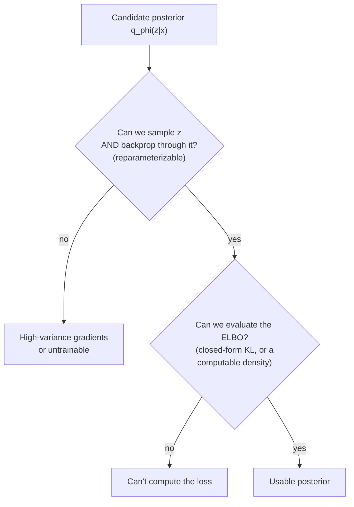
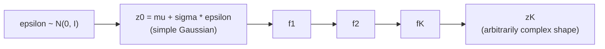

# Chapter 01a — Could the Posterior Be Something Other Than a Gaussian?

This is a side-chapter, born from a good question. In [Chapter 01](01-introduction.md)
we said the encoder outputs a **Gaussian** posterior:

$$
q_\phi(z \mid x) = \mathcal{N}(\mu(x), \mathrm{diag}(\sigma^2(x)))
$$

The network reads $x$, emits a mean $\mu(x)$ and a spread $\sigma(x)$, and we
sample the latent code $z$ from that bell curve. A natural itch follows: *why a
Gaussian?* A neural network can output as many numbers as we want — it could
just as easily emit the parameters of a mixture of Gaussians, a Gamma, a
Negative-Binomial, or some elaborate distribution with hundreds of knobs. The
network would happily learn to set all of them. So could the posterior be
something *richer*?

The answer is yes — and the reasons we *usually* don't, and the principled way
we *can*, teach you something deep about how VAEs actually work. This chapter is
optional; if you skip it you lose nothing for Chapter 02. But if the Gaussian
felt like an arbitrary default, read on — it isn't arbitrary, and seeing exactly
*why* makes everything else click.

(Recap of symbols, so this chapter stands on its own: $x$ is a data point, $z$ is
its short latent code, $\phi$ are the encoder weights, $\mu$ and $\sigma$ are the
mean and standard-deviation vectors the encoder outputs, and $q_\phi(z \mid x)$
is the encoder's distribution over $z$ — our learnable stand-in for the
intractable true posterior $p_\theta(z \mid x)$.)

---

## 1. Parameter count is not the constraint

Let's clear away the tempting-but-wrong intuition first. You might think the
Gaussian is chosen because it's *cheap* — only two vectors, $\mu$ and $\sigma$.
And richer distributions need more parameters, which sounds expensive.

But parameter count was never the problem. A neural network that already outputs
2000-dimensional gene predictions can just as easily output a few hundred extra
numbers to parameterize a fancy posterior. If a Gamma posterior needs a shape
and a rate per latent dimension, the network outputs those. If a mixture of five
Gaussians needs five means, five spreads, and five weights, the network outputs
those too. **The number of knobs is free.**

So if it isn't about parameter count, what *is* the constraint? It comes down to
two specific operations the posterior must support to be trainable at all.

---

## 2. The two things any posterior must support

Remember what the training loss asks of $q_\phi$. The ELBO has two terms:

$$
\mathcal{L} = -\mathbb{E}_{q_\phi(z \mid x)}[\log p_\theta(x \mid z)] + \text{KL}(q_\phi(z \mid x) \| p(z))
$$

Look at what each term *does* with $q_\phi$, and you get a checklist that any
candidate posterior must pass.

**Requirement 1 — we must be able to sample $z$, and differentiate through the
sampling.** The reconstruction term is an average "over $z$ drawn from
$q_\phi$." We estimate that average by actually drawing a $z$ and decoding it.
But we also need the *gradient* of the loss with respect to the encoder weights
$\phi$ — and $\phi$ controls the very distribution we're sampling from. Naively,
"sample" is a random, non-differentiable operation; you can't backpropagate
through a coin flip. The Gaussian rescues us with the **reparameterization
trick**:

$$
z = \mu(x) + \sigma(x) \odot \varepsilon, \quad \varepsilon \sim \mathcal{N}(0, I)
$$

Define the pieces: $\varepsilon$ (epsilon) is pure noise drawn from a *fixed*
standard normal that doesn't depend on $\phi$; $\odot$ is elementwise
multiplication. The randomness now lives in $\varepsilon$, off to the side, while
$\mu$ and $\sigma$ enter through ordinary differentiable arithmetic. Gradients
flow straight through. (This is the subject of [VAE-04](../VAE-04-reparameterization.md)
and [VAE-05](../VAE-05-pathwise-derivative.md); here we only need that a clean,
low-variance gradient through sampling is *required*, and that the Gaussian
provides it for free.)

**Requirement 2 — we must be able to evaluate the ELBO cheaply.** The KL term
measures the gap between $q_\phi(z \mid x)$ and the prior $p(z)$. For a Gaussian
posterior against a standard-normal prior, this has a **closed form** — a tidy
formula (the one we worked numerically in Chapter 01), exact and cheap:

$$
\text{KL} = \frac{1}{2} \sum_{j} \left( \mu_j^2 + \sigma_j^2 - \log \sigma_j^2 - 1 \right)
$$

No integral, no sampling noise, just plug in $\mu$ and $\sigma$. When a closed
form *isn't* available, we fall back to estimating the KL by Monte Carlo —
drawing samples and averaging $\log q_\phi(z \mid x) - \log p(z)$ — which is only
possible if we can compute the **density** $q_\phi(z \mid x)$ (the probability it
assigns to a given $z$), and which adds noise to every gradient step.

So the real checklist is:

The Gaussian sails through both. Every richer alternative has to be judged on
whether *it* can, and at what cost. Now let's walk the candidates you asked
about.

---

## 3. The candidates

### 3.1 Full-covariance Gaussian — the cheapest upgrade

Our default Gaussian is **diagonal**: the `diag` in the formula means each latent
dimension gets its own independent variance, with no modeling of how dimensions
*co-vary*. The true posterior often has correlated dimensions (knowing $z_1$
tells you something about $z_2$), and a diagonal Gaussian simply can't represent
that.

The smallest step up is a **full-covariance Gaussian**: still a single bell curve,
but tilted and stretched in arbitrary directions. The network outputs $\mu$ plus
a full covariance matrix (in practice its Cholesky factor, to keep it valid).
Both requirements still hold — it reparameterizes as $z = \mu + L\varepsilon$
(where $L$ is the Cholesky factor, replacing the elementwise $\sigma$), and the
Gaussian-vs-Gaussian KL still has a closed form. The cost is $O(d^2)$ parameters
for a $d$-dimensional latent instead of $O(d)$, which is why for large $d$ people
often skip it. But it's the one richer posterior that keeps *both* conveniences
intact.

### 3.2 Mixture of Gaussians — when the posterior is genuinely multimodal

Here's a case with real biological motivation. Suppose a cell's expression $x$ is
ambiguous — it could plausibly be an early or a late state of the same lineage.
The honest posterior over $z$ is then **multimodal**: two separated blobs, not
one. A single Gaussian is forced to smear a fat blob across both, placing most of
its mass in the empty valley between them — a bad fit. A **mixture of Gaussians**
(a weighted sum of $K$ bell curves) can put a blob on each mode.

So why isn't this the default? Because sampling from a mixture has a hidden
**discrete** step: first pick *which* of the $K$ components to draw from (a
categorical choice), then draw a Gaussian from that component. That categorical
pick is exactly the non-differentiable coin flip Requirement 1 warned about —
you cannot reparameterize a discrete index the way you can a Gaussian. And the
KL between a mixture and the prior has **no closed form**, so Requirement 2 falls
back to noisy Monte-Carlo estimation.

There are workarounds — the **Gumbel-softmax** trick relaxes the discrete pick
into a differentiable approximation, or you can marginalize over the $K$
components when $K$ is small — but each adds either bias or cost. A mixture
posterior is a deliberate choice you make when you have evidence of
multimodality, not a free lunch.

### 3.3 Gamma and other non-negative distributions — when the latent has meaning

Sometimes you *want* the latent to be non-negative — say each $z_j$ represents
the activity level of a biological program, which can't be negative. A
**Gamma** distribution (support on positive numbers) fits that story far better
than a Gaussian, which always puts some mass below zero.

The trouble is Requirement 1. The Gaussian's gift was the clean
"location + scale × noise" reparameterization; most other distributions, Gamma
included, have **no simple location-scale form**, so the basic trick doesn't
apply. The field developed heavier machinery to cope — **implicit
reparameterization gradients** (Figurnov et al., 2018) and
**rejection-sampling reparameterization** (Naesseth et al., 2017) — that *can*
push gradients through a Gamma sample, at extra complexity. On the plus side,
Requirement 2 is often fine: a Gamma posterior against a Gamma prior *does* have
a closed-form KL. The catch is that you typically must **match the prior to the
same family** — a Gamma posterior wants a Gamma prior, not the standard normal —
which is a coordinated design change, not a drop-in swap.

### 3.4 The Negative-Binomial trap — posterior vs. decoder

This one deserves special care because it's a common and natural confusion,
especially in this project. We use the **Negative-Binomial (NB)** distribution
constantly — it's the right model for overdispersed count data. So shouldn't the
posterior be NB too?

Almost certainly not — and the reason is *which* distribution we're talking
about. The NB lives on the **decoder** side, as the likelihood
$p_\theta(x \mid z)$: the *data* $x$ is counts (integers, overdispersed), so the
distribution that *generates $x$* should be NB. That's [VAE-07](../VAE-07-NB-ZINB.md)'s
whole point. But the **latent** $z$ is a different object — a learned, abstract
summary, which we deliberately keep as a smooth continuous space so we can
interpolate, sample, and reparameterize in it. There's no reason for $z$ to be
count-valued.

If you *did* insist on a discrete or count-valued latent, you'd land in the world
of **discrete-latent VAEs** — where Requirement 1 fails hard (you can't
reparameterize a discrete draw) and you need either score-function gradient
estimators (REINFORCE, high variance), Gumbel-softmax relaxations, or a
vector-quantized approach (VQ-VAE). Discrete latents are a rich and useful
subfield — and note cell *type* is genuinely categorical, so this isn't
academic — but they are a different model class, not a posterior you swap in
casually.

> **The one-sentence takeaway for this section:** NB is the right *decoder* for
> count *data*; it is not a posterior for the *latent*. Don't let the two meet.

---

## 4. The principled general answer: normalizing flows

So far each richer family bought expressiveness by paying in either gradient
trouble (Requirement 1) or an intractable KL (Requirement 2). Is there a way to
get an *arbitrarily* flexible posterior while keeping both conveniences? Largely,
yes — **normalizing flows**, and this is the most satisfying answer to your
question.

The idea is to stop searching for a better-shaped *base* distribution and instead
**transform a simple one**. Start with the familiar Gaussian sample
$z_0 = \mu + \sigma \odot \varepsilon$. Then push it through a chain of learned,
**invertible** functions $f_1, f_2, \ldots, f_K$:

Each $f_k$ bends and stretches the distribution; stacked, they can turn a plain
Gaussian into a curved, multimodal, richly correlated shape. Because the network
controls the $f_k$, this is exactly your "sophisticated distribution with a lot
of parameters" — and crucially it keeps **both** requirements:

- **Sampling stays reparameterizable** — we still start from the fixed noise
  $\varepsilon$ and only apply differentiable transforms, so gradients flow as
  before.
- **The density stays computable** — the *change-of-variables* formula gives the
  density of the transformed sample exactly:

$$
\log q_\phi(z_K \mid x) = \log q_0(z_0 \mid x) - \sum_{k=1}^{K} \log \left| \det \frac{\partial f_k}{\partial z_{k-1}} \right|
$$

Define the new symbol: that $\left| \det \frac{\partial f_k}{\partial z_{k-1}} \right|$
is the absolute value of the **Jacobian determinant** of the $k$-th transform —
a single number measuring how much $f_k$ locally expands or shrinks volume.
Subtracting its log accounts for the squashing and stretching so the total
probability still integrates to one. Flows are *designed* so this determinant is
cheap to compute (that's the engineering art — see methods like Inverse
Autoregressive Flow, Kingma et al., 2016). With a computable $\log q_\phi$, the
ELBO is estimable by Monte Carlo even without a closed-form KL.

This is the clean way to have your cake and eat it: arbitrary expressiveness,
both requirements satisfied. The price is implementation complexity and extra
compute per step.

---

## 5. But *should* you? Where the gains actually hide

Knowing you *can* enrich the posterior, the honest question is whether it's worth
it. Two ideas help you decide.

A VAE's posterior falls short of the true posterior for two distinct reasons,
and richer $q_\phi$ only addresses one of them:

- The **approximation gap** — the chosen family simply can't represent the true
  posterior's shape (a diagonal Gaussian can't be multimodal). *This* is what
  richer posteriors (mixtures, flows) fix.
- The **amortization gap** — we use one shared encoder network to predict
  parameters for *every* $x$, rather than optimizing a bespoke posterior per data
  point. A fancier *family* doesn't fix this; a better-trained encoder does.

And there are often bigger fish than the posterior entirely:

- **The prior can matter more than the posterior.** A standard normal prior is
  itself a strong assumption. Richer priors — a mixture prior, or a
  **VampPrior** (Tomczak & Welling, 2018) that learns the prior from the
  data — sometimes buy more than richer posteriors, for less trouble.
- **The decoder likelihood is usually the real bottleneck for count data.** In
  practice, on scRNA-seq, moving from a Gaussian decoder to a proper **NB or
  ZINB** decoder ([VAE-07](../VAE-07-NB-ZINB.md)) improves results far more than
  upgrading a diagonal-Gaussian posterior to a flow. Getting the *data*
  distribution right beats getting the *latent* distribution fancy.

**Practical verdict for this project.** Default to the diagonal Gaussian
posterior. It's not a compromise you should feel bad about — it's the choice that
makes both training requirements free, and for gene-expression work the leverage
lives elsewhere (the decoder likelihood, the preprocessing, the conditioning).
Reach for a richer posterior deliberately, when you have a *specific* reason:
evidence of multimodality (consider a mixture or a flow), a need for non-negative
interpretable latents (consider Gamma, with a matching prior), or a genuinely
categorical latent like cell type (consider a discrete-latent model). The right
mental model is a toolbox, not a ladder — "richer" is not automatically "better."

---

## Recap, and back to the main path

What this side-chapter established:

- **Parameter count is never the constraint** — a network can output as many
  distribution parameters as you like.
- A usable posterior must pass **two tests**: reparameterizable sampling
  (Requirement 1) and a cheaply evaluable ELBO via closed-form KL or a computable
  density (Requirement 2). The diagonal Gaussian passes both *for free*, which is
  why it's the default.
- Richer families each strain one test: **mixtures** and **discrete latents**
  break differentiable sampling; **Gamma**-type families lose the easy
  reparameterization and want a matching prior; **Negative-Binomial belongs on
  the decoder, not the posterior**.
- **Normalizing flows** are the principled way to get arbitrary expressiveness
  while keeping both tests satisfied — at the cost of complexity.
- Before reaching for a richer posterior, remember the **amortization gap**, the
  leverage of a **richer prior**, and — for count data especially — that the
  **decoder likelihood is usually the bigger win**.

With that curiosity satisfied, we return to the main spine. Next is
**[Chapter 02 — Datasets](02-datasets.md)**: what the training data actually
looks like, why count data forces specific choices on the *decoder* (the place
NB really belongs), and whether diffusion and flow-matching models want the same
data a VAE does.
