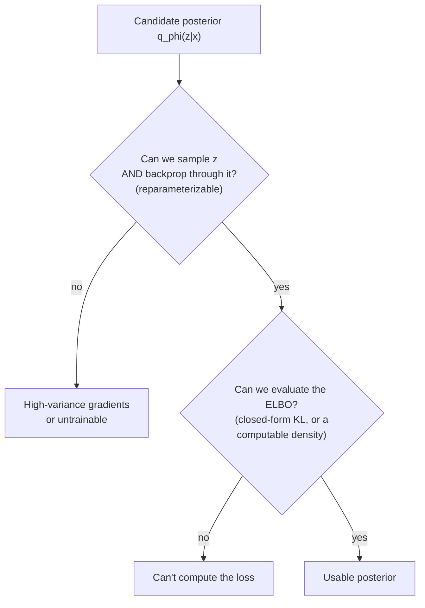
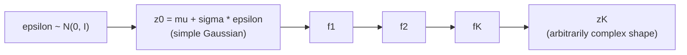

# Chapter 01a — Could the Posterior Be Something Other Than a Gaussian?

*An optional aside, born from a good question. Skippable — [Chapter 02](02-datasets.md)
doesn't depend on it. Symbols are in the [notation reference](notation.md).*

In [Chapter 01](01-introduction.md) we said the encoder outputs a **Gaussian**
posterior, $q_\phi(z \mid x) = \mathcal{N}(\mu(x), \mathrm{diag}(\sigma^2(x)))$:
the network reads $x$, emits a mean $\mu(x)$ and a spread $\sigma(x)$, and we
sample the latent code $z$ from that bell curve. A natural itch follows — *why a
Gaussian?* A neural network can output as many numbers as we like; it could just
as easily emit the parameters of a mixture of Gaussians, a Gamma, a
Negative-Binomial, or some elaborate distribution with hundreds of knobs, and it
would happily learn to set them all. So could the posterior be something richer?

The answer is yes — and the reasons we *usually* don't, together with the
principled way we *can*, teach you something deep about how VAEs actually work.
(As a one-line recap so this chapter stands alone: $q_\phi(z \mid x)$ is the
encoder's distribution over the latent $z$, our learnable stand-in for the
intractable true posterior $p_\theta(z \mid x)$, with $\phi$ the encoder weights
and $\mu, \sigma$ the mean and spread it outputs.)

## Parameter count is not the constraint

Let's clear away the tempting-but-wrong intuition first. You might think the
Gaussian is chosen because it's cheap — only two vectors, $\mu$ and $\sigma$ —
and richer distributions need more parameters, which sounds expensive. But
parameter count was never the problem. A network that already outputs
2000-dimensional gene predictions can just as easily output a few hundred extra
numbers to parameterize a fancy posterior: if a Gamma posterior needs a shape and
a rate per latent dimension, the network outputs those; if a mixture of five
Gaussians needs five means, five spreads, and five weights, it outputs those too.
The number of knobs is free.

So if it isn't about parameter count, what *is* the constraint? It comes down to
two specific operations the posterior must support to be trainable at all.

## The two things any posterior must support

Remember what the loss asks of $q_\phi$. The ELBO has a reconstruction term,
$-\mathbb{E}_{q_\phi(z \mid x)}[\log p_\theta(x \mid z)]$, and a KL term,
$\text{KL}(q_\phi(z \mid x) \| p(z))$. Look at what each *does* with $q_\phi$ and
a checklist falls out.

The first requirement is that **we must be able to sample $z$, and differentiate
through the sampling.** The reconstruction term is an average over $z$ drawn from
$q_\phi$, which we estimate by actually drawing a $z$ and decoding it — but we
also need the gradient of the loss with respect to the encoder weights $\phi$,
and $\phi$ controls the very distribution we're sampling from. Naively, "sample"
is a random, non-differentiable step; you can't backpropagate through a coin
flip. The Gaussian rescues us with the **reparameterization trick**: write
$z = \mu(x) + \sigma(x) \odot \varepsilon$ with $\varepsilon \sim \mathcal{N}(0, I)$,
where $\varepsilon$ is pure noise drawn from a *fixed* standard normal that
doesn't depend on $\phi$, and $\odot$ is elementwise multiplication. The
randomness now lives in $\varepsilon$, off to the side, while $\mu$ and $\sigma$
enter through ordinary differentiable arithmetic, so gradients flow straight
through. (This is the subject of [VAE-04](../VAE-04-reparameterization.md) and
[VAE-05](../VAE-05-pathwise-derivative.md); here we need only that a clean,
low-variance gradient through sampling is *required*, and that the Gaussian
provides it for free.)

The second requirement is that **we must be able to evaluate the ELBO cheaply.**
The KL term measures the gap between $q_\phi(z \mid x)$ and the prior $p(z)$, and
for a Gaussian posterior against a standard-normal prior this has a closed form —
the tidy $\frac{1}{2} \sum_j (\mu_j^2 + \sigma_j^2 - \log \sigma_j^2 - 1)$ we
worked numerically in [Chapter 01](01-introduction.md), exact and cheap. When a closed form *isn't*
available, we fall back to estimating the KL by Monte Carlo — drawing samples and
averaging $\log q_\phi(z \mid x) - \log p(z)$ — which is only possible if we can
compute the **density** $q_\phi(z \mid x)$ (the probability it assigns to a given
$z$), and which adds noise to every gradient step.

So the real test any candidate posterior must pass is just these two gates:

The Gaussian sails through both. Every richer alternative has to be judged on
whether it can, and at what cost. Let's walk the candidates you asked about.

## Walking the candidates

The cheapest upgrade is a **full-covariance Gaussian**. Our default is *diagonal*
— the `diag` in the formula means each latent dimension gets its own independent
variance, with no modeling of how dimensions co-vary — but the true posterior
often has correlated dimensions, where knowing $z_1$ tells you something about
$z_2$. A full-covariance Gaussian is still a single bell curve, just tilted and
stretched in arbitrary directions: the network outputs $\mu$ plus a full
covariance (in practice its Cholesky factor $L$, to keep it valid). Both gates
still hold — it reparameterizes as $z = \mu + L\varepsilon$, and the
Gaussian-versus-Gaussian KL still has a closed form — at a cost of $O(d^2)$
parameters for a $d$-dimensional latent instead of $O(d)$, which is why for large
$d$ people often skip it. It's the one richer posterior that keeps *both*
conveniences intact.

A **mixture of Gaussians** is the next step, and it has real biological
motivation. Suppose a cell's expression $x$ is ambiguous — it could plausibly be
an early or a late state of the same lineage — so the honest posterior over $z$
is *multimodal*, two separated blobs rather than one. A single Gaussian is forced
to smear a fat blob across both, piling mass in the empty valley between them; a
mixture (a weighted sum of $K$ bell curves) can put a blob on each mode. Why
isn't this the default, then? Because sampling from a mixture hides a *discrete*
step — first pick which of the $K$ components to draw from, a categorical choice,
then draw a Gaussian from it — and that categorical pick is exactly the
non-differentiable coin flip the first gate warned about. The KL between a mixture
and the prior also has no closed form, so the second gate falls back to noisy
Monte-Carlo estimation. There are workarounds — the **Gumbel-softmax** trick
relaxes the discrete pick into a differentiable approximation, or you can
marginalize over the components when $K$ is small — but each adds bias or cost. A
mixture posterior is a deliberate choice when you have evidence of multimodality,
not a free lunch.

Sometimes you instead want the latent to be *non-negative* — say each $z_j$
represents the activity level of a biological program, which can't go below zero.
A **Gamma** distribution (supported on positive numbers) fits that story far
better than a Gaussian, which always puts some mass below zero. The trouble is the
first gate: the Gaussian's gift was the clean "location + scale × noise"
reparameterization, and most other distributions, Gamma included, have no simple
location-scale form, so the basic trick doesn't apply. The field developed heavier
machinery to cope — **implicit reparameterization gradients** (Figurnov et al.,
2018) and **rejection-sampling reparameterization** (Naesseth et al., 2017) — that
can push gradients through a Gamma sample at extra complexity. The second gate is
often fine, since a Gamma posterior against a Gamma prior *does* have a
closed-form KL; the catch is that you typically must match the prior to the same
family, a coordinated design change rather than a drop-in swap.

That brings us to the trap most likely to catch a reader of *this* project: the
**Negative-Binomial**. We use the NB constantly — it's the right model for
overdispersed count data — so shouldn't the posterior be NB too? Almost certainly
not, and the reason is *which* distribution we mean. The NB lives on the
**decoder** side, as the likelihood $p_\theta(x \mid z)$: the *data* $x$ is counts
(integers, overdispersed), so the distribution that *generates $x$* should be NB —
that's [VAE-07](../VAE-07-NB-ZINB.md)'s whole point. But the latent $z$ is a
different object, a learned abstract summary that we deliberately keep as a smooth
continuous space so we can interpolate, sample, and reparameterize in it; there's
no reason for $z$ to be count-valued. If you *did* insist on a discrete latent
you'd land in the world of **discrete-latent VAEs**, where the first gate fails
hard (you can't reparameterize a discrete draw) and you need score-function
estimators (REINFORCE, high variance), Gumbel-softmax relaxations, or a
vector-quantized approach (VQ-VAE). Discrete latents are a rich and useful
subfield — and note that cell *type* is genuinely categorical, so this isn't
academic — but they're a different model class, not a posterior you swap in
casually. The one sentence to carry away: **NB is the right decoder for count
data; it is not a posterior for the latent. Don't let the two meet.**

## The principled general answer: normalizing flows

So far each richer family bought expressiveness by paying in either gradient
trouble or an intractable KL. Is there a way to get an *arbitrarily* flexible
posterior while keeping both conveniences? Largely yes — **normalizing flows** —
and this is the most satisfying answer to your question.

The idea is to stop searching for a better-shaped *base* distribution and instead
*transform* a simple one. Start from the familiar Gaussian sample
$z_0 = \mu + \sigma \odot \varepsilon$, then push it through a chain of learned,
**invertible** functions $f_1, f_2, \ldots, f_K$, each bending and stretching the
distribution until, stacked, they turn a plain Gaussian into a curved,
multimodal, richly correlated shape:

Because the network controls the transforms, this is exactly your "sophisticated
distribution with a lot of parameters" — and crucially it keeps *both* gates.
Sampling stays reparameterizable, since we still start from the fixed noise
$\varepsilon$ and only apply differentiable transforms. And the density stays
computable, because the change-of-variables formula gives it exactly:

$$
\log q_\phi(z_K \mid x) = \log q_0(z_0 \mid x) - \sum_{k=1}^{K} \log \left| \det \frac{\partial f_k}{\partial z_{k-1}} \right|
$$

The new piece, $\left| \det \frac{\partial f_k}{\partial z_{k-1}} \right|$, is the
absolute value of the **Jacobian determinant** of the $k$-th transform — a single
number measuring how much $f_k$ locally expands or shrinks volume — and
subtracting its log accounts for that squashing and stretching so the total
probability still integrates to one. Flows are *designed* so this determinant is
cheap to compute (that's the engineering art — see Inverse Autoregressive Flow,
Kingma et al., 2016), and with a computable $\log q_\phi$ the ELBO is estimable by
Monte Carlo even without a closed-form KL. This is the clean way to have your cake
and eat it: arbitrary expressiveness, both gates satisfied, at the price of
implementation complexity and extra compute per step.

## But should you? Where the gains actually hide

Knowing you *can* enrich the posterior, the honest question is whether it's worth
it — and two ideas help you decide. A VAE's posterior falls short of the true
posterior for two distinct reasons, and richer $q_\phi$ only addresses one. The
**approximation gap** is the chosen family simply being unable to represent the
true posterior's shape (a diagonal Gaussian can't be multimodal); *that* is what
richer posteriors fix. The **amortization gap** is that we use one shared encoder
network to predict parameters for *every* $x$, rather than optimizing a bespoke
posterior per data point; a fancier *family* doesn't fix this — a better-trained
encoder does.

And there are often bigger fish than the posterior entirely. The *prior* can
matter more: a standard normal is itself a strong assumption, and richer priors —
a mixture prior, or a **VampPrior** (Tomczak & Welling, 2018) that learns the
prior from the data — sometimes buy more than richer posteriors for less trouble.
More to the point for count data, the *decoder likelihood* is usually the real
bottleneck: in practice, on scRNA-seq, moving from a Gaussian decoder to a proper
NB or ZINB ([VAE-07](../VAE-07-NB-ZINB.md)) improves results far more than
upgrading a diagonal-Gaussian posterior to a flow. Getting the *data*
distribution right beats getting the *latent* distribution fancy.

So the practical verdict for this project is to default to the diagonal Gaussian
posterior. It's not a compromise to feel bad about — it's the choice that makes
both training gates free, and for gene-expression work the leverage lives
elsewhere (the decoder likelihood, the preprocessing, the conditioning). Reach
for a richer posterior deliberately, when you have a *specific* reason: evidence
of multimodality (a mixture or a flow), a need for non-negative interpretable
latents (Gamma, with a matching prior), or a genuinely categorical latent like
cell type (a discrete-latent model). The right mental model is a toolbox, not a
ladder — "richer" is not automatically "better."

## Recap, and back to the main path

Parameter count is never the constraint — a network can output as many
distribution parameters as you like. What a usable posterior must pass is two
gates: reparameterizable sampling, and a cheaply evaluable ELBO via closed-form KL
or a computable density. The diagonal Gaussian passes both for free, which is why
it's the default. Richer families each strain one gate — mixtures and discrete
latents break differentiable sampling; Gamma-type families lose the easy
reparameterization and want a matching prior; the Negative-Binomial belongs on the
decoder, not the posterior. Normalizing flows are the principled way to get
arbitrary expressiveness while keeping both gates, at the cost of complexity. And
before reaching for any of it, remember the amortization gap, the leverage of a
richer prior, and — for count data especially — that the decoder likelihood is
usually the bigger win.

*Next: back to the main spine, [Chapter 02 — Datasets](02-datasets.md): what the
training data looks like, why count data forces specific choices on the decoder
(the place NB really belongs), and whether diffusion and flow-matching models want
the same data a VAE does.*
