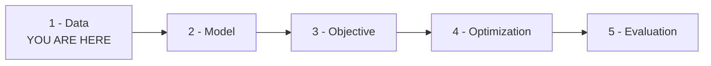
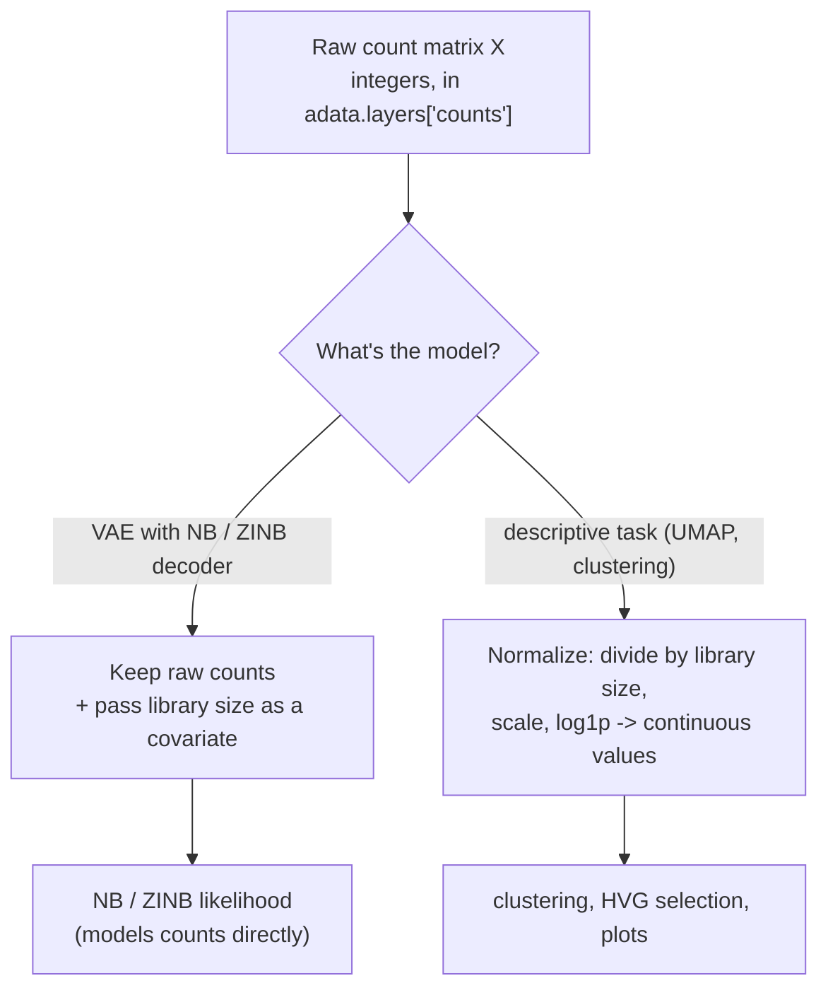

# Chapter 02 — Datasets: What Feeds a VAE

*Stage 1 of the [pipeline](README.md): what the training data is, and how to
prepare it without quietly ruining everything downstream. Symbols are in the
[notation reference](notation.md).*

We have a model (encoder + decoder) and an objective (the negative ELBO). Now we
reach the first stage of training that actually touches the world: the data. This
is the stage people are most tempted to rush, and the one where rushing quietly
ruins everything downstream — a VAE trained on wrongly-prepared data can still
produce a beautiful loss curve while learning nonsense, exactly the trap we named
in [Chapter 01](01-introduction.md). So this chapter slows down on two questions: what does a VAE's
training data actually look like, especially the single-cell gene-expression data
this project cares about, and what's genuinely strange about it; and do diffusion
and flow-matching models want the same data a VAE does? (That second one was your
question from the outset, and the answer — *same raw material, different
preparation* — is illuminating about all three model families.)

A gentle recap so this chapter stands on its own: a VAE's encoder
$q_\phi(z \mid x)$ maps a data point $x$ to a latent code $z$, and its decoder
$p_\theta(x \mid z)$ maps a latent back to data. The decoder isn't just a function
— it's a *probability distribution* over $x$, and the *shape* of that distribution
has to match the *shape* of the data. That last sentence is the hinge this whole
chapter turns on.

## The shape of the data: a big table of numbers

At the most basic level, a VAE's training data is a **matrix** — a rectangular
table of numbers, written $X \in \mathbb{R}^{N \times D}$. Here $X$ is the whole
dataset, $N$ is the number of **samples** (rows), $D$ is the number of
**features** (columns), and $\mathbb{R}^{N \times D}$ just means "a table of real
numbers with $N$ rows and $D$ columns." Each row is one data point $x$ — the same
$x$ that flows through the encoder.

For our running PBMC example this is concrete: a row is one immune cell, a column
is one gene, and an entry $X_{ij}$ is how many RNA molecules of gene $j$ were
detected in cell $i$. With 3000 cells and 2000 genes, $N = 3000$, $D = 2000$, and
$X$ is a 3000-by-2000 table of counts — the object we feed the model. (In code
this lives in an `AnnData` object, the standard single-cell container; the count
matrix sits in `adata.X` or, by our convention, `adata.layers["counts"]`.)

This matrix-of-numbers framing is universal across VAE applications; only the
*meaning* of rows, columns, and entries changes:

| Application | A row $x$ is... | A feature (column) is... | An entry is... |
|-------------|-----------------|--------------------------|----------------|
| Image VAE | one image | one pixel | brightness, often in $[0, 1]$ |
| Tabular VAE | one record | one field | a measurement (mixed types) |
| **scRNA-seq VAE** | **one cell** | **one gene** | **a count (non-negative integer)** |

The single-cell row is the one with the personality, and the rest of this section
is about why.

## What makes single-cell count data strange

If you've only ever seen image or tabular data, gene-expression counts will
surprise you in three ways, and each one forces a modeling decision. We'll use one
tiny worked matrix throughout — three cells, five genes:

| Cell | GeneA | GeneB | GeneC | GeneD | GeneE | row total |
|------|-------|-------|-------|-------|-------|-----------|
| Cell 1 | 0 | 3 | 0 | 12 | 1 | **16** |
| Cell 2 | 0 | 6 | 0 | 24 | 2 | **32** |
| Cell 3 | 5 | 0 | 8 | 0 | 0 | **13** |

The first surprise is that **the entries are counts, not real numbers.** Every
entry is a non-negative integer — you can detect 0, 1, 2, … molecules of a gene,
never 2.7. This already rules out the most common default: a plain VAE uses a
**Gaussian decoder**, modeling each $x$ value as a bell curve that lives on the
whole real line and happily assigns probability to negative and fractional
values. A bell curve is the wrong shape for a count. The right shapes are count
distributions — the **Poisson**, or as we'll see the **Negative-Binomial** — which
is the decoder choice from [VAE-07](../VAE-07-NB-ZINB.md) and the deep reason that
chapter exists.

The second surprise is that **the data is extremely sparse.** More than half the
toy matrix is zero, and real scRNA-seq is far worse, commonly 90% or more zeros.
Some of those zeros are real (the gene truly isn't expressed in that cell), but
many are **dropouts** — technical false-zeros, where a gene *was* expressed but
the measurement missed it because single-cell capture is noisy and shallow. That
excess of zeros, beyond what even a count distribution like the Negative-Binomial
expects, is exactly what the **Zero-Inflated** variant (ZINB, also in
[VAE-07](../VAE-07-NB-ZINB.md)) is built to absorb. Sparsity isn't a nuisance to
normalize away; it's a signal the decoder should model directly.

The third surprise is the subtle one, and it's the key to the rest of the
chapter: **rows aren't measured at the same depth.** Compare Cell 1
(`[0, 3, 0, 12, 1]`, total 16) with Cell 2 (`[0, 6, 0, 24, 2]`, total 32). Cell
2's counts are exactly double Cell 1's, gene for gene — biologically these two
cells have the *same* expression profile, the same proportions of each gene, and
the only difference is that Cell 2 happened to be measured twice as deeply. That
total-counts-per-cell number is the **library size** (16 for Cell 1, 32 for Cell
2, 13 for Cell 3): the sum of all counts in a cell, a mostly *technical* quantity
reflecting how efficiently that cell was sampled, not a biological property. And
it sets a trap — if you feed raw counts to a model without telling it about depth,
the model sees Cell 1 and Cell 2 as different and may waste capacity "explaining"
a difference that is pure technical artifact. We have to handle library size
deliberately, and there are two philosophies for doing so. The choice of model
decides which one you use.

## Two ways to handle depth — and why the VAE picks the harder one

The classic single-cell approach is to **normalize the depth away.** You divide
each cell's counts by its library size (removing depth), rescale to a common
target, and take a log — the standard *counts-per-X plus log1p* recipe,
$\tilde{x}_{ij} = \log(1 + \frac{X_{ij}}{L_i} \cdot s)$, where $L_i$ is cell
$i$'s library size (its row total), $s$ is a fixed **target sum** (a scale
constant, e.g. 10,000 for real data or just 10 for our toy), and $\log(1 + \cdot)$
is **log1p**, a log that's safe at zero since $\log(1+0) = 0$. The result is a
continuous, real-valued, roughly bell-shaped number. Watch what it does to our toy
cells at GeneD with target $s = 10$: Cell 1 gives
$\log(1 + \frac{12}{16} \cdot 10) = \log(8.5) \approx 2.14$, and Cell 2 gives
$\log(1 + \frac{24}{32} \cdot 10) = \log(8.5) \approx 2.14$ — *identical*, exactly
as biology says they should be. Normalization made the technical depth difference
vanish, which is wonderful for descriptive tasks like clustering, UMAPs, and
variable-gene selection, and it's why the field reaches for it reflexively. But
there's a cost: the moment you normalize and log, the data is no longer counts.
It's continuous and fractional, the integer count-generating story is gone, and
you cannot hand $\tilde{x}$ to a Negative-Binomial decoder, which is defined on
integers.

The VAE-with-NB approach takes the opposite stance: **keep the raw integer counts
untouched, and give the model the library size as extra information** so it can
account for depth itself. Rather than erasing the difference between Cell 1 and
Cell 2, we *tell* the decoder "Cell 1 was sampled at depth 16, Cell 2 at depth 32"
and let it scale its predictions accordingly — the library size enters as a
**covariate**, an auxiliary input alongside the latent code, not as a
preprocessing step that mutates the data. Why go to this trouble? Because the
count-generating story is exactly what makes a generative model of cells faithful.
The NB decoder models how integer counts actually arise (a Gamma-Poisson process,
derived in [VAE-08](../VAE-08-NB-likelihood.md)), including the right relationship
between a gene's mean and its variance; throw the counts away and you throw away
the very structure a generative model should learn. This is why, across this
project, **raw counts are non-negotiable for NB/ZINB decoders** — a guardrail
you'll see stated in the conventions and enforced in code.

The elegant part is that in practice you use *both*, each for what it's good at.
The canonical genai-lab recipe for **highly variable gene (HVG) selection** —
choosing the ~2000 most informative genes to keep — does exactly this: make a
log-normalized *copy* purely to *decide* which genes are highly variable (the
**HVG**s, the genes whose expression varies most across cells, carrying biological
signal rather than flat background), transfer those HVG flags back to the original
raw-count `AnnData`, then subset the raw-count matrix to those genes. The
normalized copy is a disposable scratchpad for *selection*; the raw counts are
what you actually *train* on. (The exact code pattern is in
[the PBMC dataset tutorial](../../../notebooks/vae/docs/pbmc_dataset_tutorial.md),
§4.) One more discipline: compute the library size on the *full* gene set, before
HVG subsetting — depth is a property of the whole cell, not of the 2000 genes you
happened to keep.

## Do diffusion and flow-matching models want the same data?

Now your original question, which we're finally equipped to answer well. People
speak of VAEs, diffusion models, and flow-matching models interchangeably as
"generative models," so do they all eat the same data? The short answer is that
**the raw material is the same; the required preparation is not.** All three start
from the very same object — for us, the same `AnnData` count matrix of cells by
genes; there's no separate "diffusion dataset." But each family makes a different
*assumption* about the data it's handed, and that assumption dictates the
preprocessing.

The dividing line is one idea: diffusion and flow matching are built on the notion
of *smoothly adding noise to, or smoothly interpolating, the data*. A diffusion
model learns to reverse a process that gradually adds **Gaussian noise** to a data
point until it becomes pure static, then denoises step by step; a flow-matching
model learns a smooth path that continuously *interpolates* between random noise
and a real data point. Both moves — "add a little Gaussian noise," "take a point
30% of the way from noise to data" — only make sense if the data lives on a
*continuous* scale. Ask what they mean on raw counts and the trouble is immediate:
what is "Cell 1 plus a little Gaussian noise"? You'd get
`[-0.4, 3.2, 0.1, 11.8, …]` — negative, fractional pseudo-counts that aren't valid
cells at all. Adding Gaussian noise to integers is a category error.

So the mainstream, Gaussian-flavored diffusion and flow-matching models want the
*continuous, normalized* form of the data — the normalization from the previous
section, usually with **standardization** on top (shifting and scaling each
feature to roughly zero mean and unit variance, which keeps the noise scale
sensible across genes). They want precisely the representation the NB-decoder VAE
refuses to use. Putting it in one table:

| Model family | Core operation on the data | Data assumption | Typical preprocessing | Decoder / output |
|--------------|----------------------------|-----------------|-----------------------|------------------|
| **VAE + NB/ZINB** | encode to a latent, decode a likelihood | data is **counts** | **keep raw counts** + library size covariate | NB / ZINB (integer-valued) |
| **VAE + Gaussian** | same, simpler decoder | data is continuous | log-normalize | Gaussian (real-valued) |
| **Diffusion** | add/remove Gaussian noise gradually | data is **continuous** | log-normalize **+ standardize** | continuous (denoised) |
| **Flow matching** | interpolate noise ↔ data | data is **continuous** | log-normalize **+ standardize** | continuous (transported) |

The practical upshot for a project like this is that you maintain *one* dataset
and *branch at preprocessing*. The raw counts in `adata.layers["counts"]` feed the
NB-decoder VAE; a log-normalized-and-standardized view of the *same* `AnnData`
feeds a diffusion or flow-matching model. You don't re-collect data; you choose a
preparation to match the model's assumption.

One honest caveat: "diffusion needs continuous data" is the mainstream case, not
an iron law. Researchers have built *discrete* diffusion models and *count-aware*
generative processes that operate on integers directly. But the default,
best-supported tooling — and the version you'll meet first — assumes continuous
data, so that's the contract to plan around unless you're deliberately reaching
for a count-native variant. (This comparison currently lives inside the VAE
training series because that's where the question arose; if the project's
diffusion and flow tracks grow to need it, it's a natural candidate to lift into a
shared top-level "what data do generative models need?" document.)

## The running example's data plumbing

To keep later chapters reproducible, here's the data path our running example
assumes, consistent with the project's conventions. Datasets live under
`data/<modality>/<sub-topic>/<dataset>/` — for PBMC that's `data/scrna/pbmc/...`,
and for the flagship perturbation work `data/scrna/perturb_seq/norman_2019/` (see
[the Norman dataset tutorial](../../../notebooks/perturbation/docs/norman_2019_dataset_tutorial.md)
and [data/README.md](../../../data/README.md) for the full layout). Raw counts are
preserved in `adata.layers["counts"]` *before* any normalization touches
`adata.X`; library size is computed on the full gene set and carried as a
covariate; and HVG selection follows the log-normalized-copy-then-transfer pattern
above. None of these are bureaucratic details — every one protects an assumption
the NB decoder relies on, and getting the data stage right is most of what
separates a VAE that learns real biology from one that learns measurement
artifacts.

## Recap, and what's next

A VAE's training data is a matrix $X \in \mathbb{R}^{N \times D}$ — $N$ samples by
$D$ features, for us cells by genes, with entries that are counts. Those counts are
integer-valued, extremely sparse (with technical dropouts), and measured at uneven
depth (library size) — three properties that each force a modeling choice. There
are two ways to handle depth: normalize it away (continuous, great for descriptive
tasks but destroys the count structure) or keep raw counts and model depth via a
library-size covariate (the VAE-with-NB path, which preserves the count-generating
story — raw counts are non-negotiable). The practical pattern uses both: a
log-normalized *copy* to select HVGs, the raw counts to train. And diffusion and
flow-matching models share the same raw data but assume it's continuous, because
their core operations are meaningless on integers — so you keep one dataset and
branch at preprocessing.

*Next: [Chapter 03 — The Training Loop](03-the-training-loop.md): with the data
prepared correctly, we run the optimization — the loop that feeds batches,
computes the loss, and updates the weights — and learn to read its output,
including how to spot the VAE's most notorious failure, posterior collapse.*
