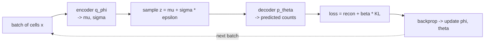
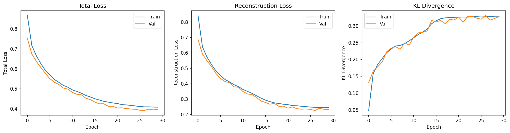

# Chapter 03 — The Training Loop: Running It, and Reading It

*Stages 3–4 of the [pipeline](README.md): turn the objective into an actual loop,
then learn to read what the loop tells you — including how to catch the VAE's most
notorious failure. Symbols are in the [notation reference](notation.md).*

The data is prepared ([Chapter 02](02-datasets.md)) and we know the objective
([Chapter 01](01-introduction.md)). Now we run the thing. This chapter has two
halves that mirror how training actually feels: first the **mechanics** — the loop
that feeds batches and updates weights — and then the **interpretation** — sitting
in front of a scrolling log and knowing whether what you see is healthy or quietly
broken. We stay on the gentle **PBMC warm-up** here; the perturbation flagship
arrives in Chapters 04–06. The mechanics are identical either way.

A one-line recap to stand on. Training minimizes the **negative ELBO**, a
reconstruction term plus a KL term: the reconstruction term wants the decoder
$p_\theta(x \mid z)$ to rebuild the input faithfully, and the KL term wants the
encoder's cloud $q_\phi(z \mid x)$ to stay near the prior $p(z) = \mathcal{N}(0, I)$.
Training is the tug-of-war between them.

## One knob worth adding: β

Before we run anything, we add a single dial to the objective. In practice we
rarely weight the two terms equally; we scale the KL term by a number $\beta$
("beta"):

$$
\mathcal{L} = \mathcal{L}_{\text{recon}} + \beta \cdot \mathcal{L}_{\text{KL}}
$$

Here $\mathcal{L}_{\text{recon}}$ is the reconstruction loss (the negative
decoder log-likelihood — the NB likelihood for our count data, an MSE for a
Gaussian decoder) and $\mathcal{L}_{\text{KL}}$ is the KL term. When $\beta = 1$
this is exactly the standard VAE from [Chapter 01](01-introduction.md). Turning $\beta$ below 1
prioritizes reconstruction and tolerates a larger KL; turning it above 1 leans on
regularization and pushes the encoder harder toward the prior, which encourages a
more disentangled latent space. The reason $\beta$ matters so much in practice —
and why it isn't just a cosmetic weight — becomes clear once we meet posterior
collapse, because $\beta$ is the main lever for preventing it.

## The loop itself

A training loop is humbler than the theory around it. We repeat the following over
many passes through the data (each full pass is an **epoch**), feeding the model a
**batch** of cells at a time rather than one or all at once. For each batch: run
the cells through the encoder to get $\mu$ and $\sigma$; draw a latent $z$ with the
reparameterization trick $z = \mu + \sigma \odot \varepsilon$ (the trick from
[VAE-04](../VAE-04-reparameterization.md) that keeps the sampling differentiable —
the noise $\varepsilon$ is fixed, so gradients flow through $\mu$ and $\sigma$);
decode $z$ to a predicted distribution over the counts; compute the two loss terms;
and let the optimizer nudge the weights $\phi$ and $\theta$ downhill.



The optimizer is almost always **Adam**, a robust default that adapts its step
size per parameter; you rarely need anything fancier for a VAE. The only
VAE-specific subtlety in the whole loop is that sampling step — and the
reparameterization trick is precisely what makes it ordinary, letting the gradient
pass through a random draw as if it weren't there. Everything else is the same
loop you'd write for any neural network.

## Reading the training log

Run the loop and it prints something like this each epoch (or every few):

```text
epoch 001 | train loss=0.8684 recon=0.8440 kl=0.0488 | val loss=0.7531
epoch 005 | train loss=0.5926 recon=0.4825 kl=0.2203 | val loss=0.5779
epoch 010 | train loss=0.5083 recon=0.3807 kl=0.2554 | val loss=0.4987
epoch 018 | train loss=0.4374 recon=0.2755 kl=0.3238 | val loss=0.4253
```

Three numbers carry the story. The **loss** is the full objective,
$\text{recon} + \beta \cdot \text{kl}$, and lower is better. The **recon** is the
reconstruction term alone — how faithfully the decoder rebuilds the input — and we
want it falling. The **kl** is the KL term, and reading it is less obvious than it
looks: it measures how much the latent space is being *used*, so we actually want
it to *rise* off the floor early on and then settle, not to sit at zero. The
**val** columns repeat the loss on held-out cells the model never trained on; when
train and val track each other the model is generalizing, and when they peel apart
the model is overfitting.

So a healthy run looks like the log above: total loss decreasing, reconstruction
improving steadily, KL climbing from near-zero (here 0.05) up to a modest plateau
(here ~0.32) rather than collapsing back down, and train ≈ val throughout. The
one counter-intuitive habit to build is to *distrust a KL that stays near zero*,
even though it makes the total loss look pleasingly small — which brings us to the
failure this chapter is really about.

## The KL term up close

The KL has a closed form for our Gaussian encoder against the standard-normal
prior, summed over the $d$ latent dimensions:

$$
\mathcal{L}_{\text{KL}} = \frac{1}{2} \sum_{j=1}^{d} \left( \mu_j^2 + \sigma_j^2 - \log \sigma_j^2 - 1 \right)
$$

We worked this number by hand in Chapter 01 and got ≈0.07 for one example cell.
Reading the *aggregate* KL across a run is a matter of calibration. A value near
zero means the encoder's cloud has become the prior — $q_\phi(z \mid x) \approx p(z)$
— so the latent carries essentially no information about the input. A modest value,
very roughly in the 0.1–1.0 range per the conventions we use here, means the latent
is encoding meaningful, input-specific variation. A very large value can signal
underfitting, or that $\beta$ is too small and the latent is being allowed to drift
far from the prior. The single most useful refinement of "the KL" is to look at it
*per dimension* and count how many latent dimensions carry real signal — the
**active units**. A latent of size 10 whose KL is split across, say, 6 dimensions
is using its capacity; one whose KL has fled to zero in all 10 has stopped using
the latent at all.

## Posterior collapse: when KL ≈ 0 is a disaster

Here is the trap. Suppose the log shows a KL pinned near zero while the
reconstruction still looks fine and the total loss is low. Mathematically nothing
is wrong — the model is happily minimizing its objective. But what has happened is
**posterior collapse**: the encoder has learned to output the *same* distribution,
the prior, no matter what cell it's shown, $q_\phi(z \mid x) \approx \mathcal{N}(0, I)$
for every $x$. The latent code has become decoration. Every cell maps to the same
fuzzy blob, $z$ carries no information about which cell it came from, and the
latent space — the entire reason we built a VAE — is useless for anything
downstream.

Why would a model do this to itself? Because it found an easy shortcut. If the
decoder is powerful enough to reconstruct cells reasonably well *on its own*,
without leaning on $z$, then the cheapest way to shrink the loss is to drive the
KL term to zero by setting $q_\phi(z \mid x) = p(z)$ and letting the decoder do all
the work from a latent it has learned to ignore. The KL term, meant as a gentle
regularizer, becomes a force that switches the latent off entirely. It's most
common early in training (before the latent has learned anything worth keeping) and
with strong decoders and high $\beta$.

You detect it by triangulating three signals. The KL curve is the first tell — it
stays near zero instead of rising and settling. The latent space is the second:
project the codes $z$ down with UMAP and a healthy model shows clusters by
meaningful factors (cell types, here) while a collapsed one shows a single
structureless blob. And the downstream tasks are the third and most damning — a
classifier trained on collapsed latents performs near chance, because there is
genuinely no information in $z$ to use. (That downstream check is exactly the
extrinsic evaluation of [Chapter 05](05-extrinsic-evaluation.md), and posterior
collapse is the clearest case of a model that looks fine intrinsically yet fails
the moment you ask the latent to be *useful*.)

## Fixing collapse: mostly, taming the KL

The cures all amount to stopping the KL term from steamrolling the latent before
the latent has learned to earn its keep. The bluntest is to **lower $\beta$**, so
the KL penalty simply weighs less (β = 0.5, or lower for count data, is a common
starting point). The most popular is **KL annealing**: start training with
$\beta = 0$ so the model first learns good reconstructions that genuinely use the
latent, then ramp $\beta$ up to its target over the first several epochs, so the
regularizer only arrives once there's something worth regularizing. A linear
schedule is the usual form:

```python
def kl_annealing_schedule(epoch, warmup_epochs=10, max_beta=1.0):
    """Linear KL annealing: ramp beta from 0 to max_beta over the warmup."""
    return min(max_beta, max_beta * epoch / warmup_epochs)
```

Two further tools are worth knowing. **Free bits** carve out a small KL "allowance"
per latent dimension that isn't penalized, so each dimension is free to encode a
little information before the KL pressure kicks in — a targeted way to keep
dimensions active. And **cyclical annealing** repeatedly resets $\beta$ to zero and
ramps it again, giving the latent periodic chances to relearn. If none of these
help, the deeper fix is structural: the decoder may simply be too powerful relative
to the task, and reducing its capacity removes the temptation to ignore $z$ in the
first place. For gene-expression work, lowering $\beta$ and annealing handle the
large majority of cases.

## What healthy training looks like

The figure below is a real run of a conditional VAE on synthetic bulk RNA-seq,
from `notebooks/vae/01_bulk_cvae.ipynb`:



Read it left to right. The total loss (left) falls smoothly, train and validation
descending together with no gap opening up — no overfitting. The reconstruction
(center) drops fast and then plateaus as the decoder learns. And the KL (right)
rises from about 0.05 to about 0.32 and *stays* there — the latent space being
switched on and then used, the opposite of collapse. This is the textbook
healthy run: good reconstruction, an active latent, and train tracking val.

For contrast, here is what a collapsing run would whisper at you:

```text
epoch 001 | recon=0.85 kl=0.04
epoch 005 | recon=0.42 kl=0.01
epoch 010 | recon=0.31 kl=0.002
epoch 018 | recon=0.27 kl=0.0004
```

The reconstruction looks great — better, even, than the healthy run at the same
epoch. But the KL is sliding *toward* zero instead of rising, and by epoch 18 the
latent is effectively off. A glance at the loss alone would call this a triumph; a
glance at the KL calls it what it is. The fix here is to anneal $\beta$ from zero
(and probably cap it lower), then watch the KL find a nonzero home.

## Running it yourself: smoke on a laptop, realistic on a pod

A practical note that shapes every later chapter. Real training does not fit on a
laptop, but *checking that the pipeline works* should cost seconds. The runnable
companions to this series (`examples/vae/training/`, `notebooks/vae/training/`)
are built around a single idea: **the same code runs at any size, selected by one
config value**, so you never maintain a separate "toy" script that drifts from the
real one.

| Preset | Genes | Cells | Latent | Epochs | Device | Where |
|--------|-------|-------|--------|--------|--------|-------|
| `smoke` | ~200 | ~500 | 4 | 1–2 | CPU | laptop / CI |
| `local` | ~1000 | ~3k | 10 | ~20 | CPU | laptop |
| `medium` | 2000 (HVG) | full | 16–32 | full | CUDA | pod |
| `realistic` | 2000+ | full | 32+ | full | CUDA | pod |

The `smoke` preset exists to answer one question — *does the whole workflow run
end to end?* — by loading data, training a step or two, computing every metric, and
writing artifacts, all in seconds, asserting nothing about whether the model is any
good. It's the sanity gate you run locally and in CI before paying for a GPU. The
device policy follows the project convention: **CPU by default locally** (always
correct, if slow), **CUDA on a pod** via [`ops/`](../../../ops/README.md) for
anything realistic, and **skip MPS** — Apple's GPU backend has a `lgamma` bug that
poisons the NB likelihood, so we don't train on it. Auto-detection falls back CUDA
→ CPU and never selects MPS. And whatever size you run, seed numpy, torch, and
Python's `random`, and record the seed alongside the size preset in the run
metadata, so a result can be reproduced.

## Recap, and what's next

Training is a humble loop — encode, sample $z$ with the reparameterization trick,
decode, compute reconstruction + $\beta \cdot$ KL, update — wrapped in the harder
skill of *reading* it. The three log numbers tell the story: reconstruction should
fall, KL should rise off the floor and settle (not collapse to zero), and train
should track val. The signature failure is **posterior collapse**, where the KL
goes to zero because a strong decoder learned to ignore the latent — invisible in
the loss, fatal for everything downstream — and the cures are mostly about taming
the KL term ($\beta$, annealing, free bits). And the same code should run as a
seconds-long smoke test or a full pod job by changing one config value.

Notice that twice now the real verdict came from *outside* the loss — the UMAP, the
downstream classifier. That is the whole point of evaluation, and it's where we go
next.

*Next: [Chapter 04 — Intrinsic Evaluation](04-intrinsic-evaluation.md): judging the
model on its own terms — reconstruction, sample fidelity, and latent usage — and
the question of whether FID, the famous generative metric, even applies to gene
expression.*
