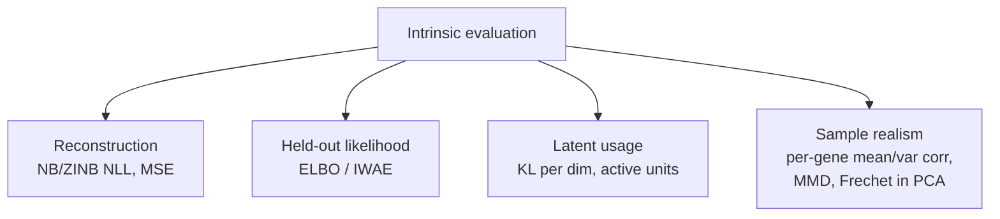

# Chapter 04 — Intrinsic Evaluation: Is the Model Good on Its Own Terms?

*Stage 5 of the [pipeline](README.md), first half. Judging a trained VAE from the
inside — reconstruction, held-out likelihood, latent usage, and sample realism —
and an honest reckoning with FID. Symbols are in the [notation reference](notation.md).*

We have a trained model and a loss curve that, let's say, looks healthy
([Chapter 03](03-the-training-loop.md)). But a healthy loss curve is necessary,
never sufficient — that was the trap we planted in [Chapter 01](01-introduction.md).
Now we make good on it. "Did it work?" splits into two independent questions, and
this chapter takes the first: **intrinsic evaluation** — is the model good *on its
own terms*, judged without reference to any downstream task? (The second question,
whether the latent is *useful for something else*, is extrinsic evaluation, and
it's [Chapter 05](05-extrinsic-evaluation.md).) We stay on the PBMC warm-up; the
perturbation flagship's evaluation builds on exactly these tools.

Intrinsic evaluation asks three things, really: can the model *rebuild* data it's
shown, does it assign high *probability* to data it hasn't seen, and do the cells
it *generates* look like real cells? Before we build that toolbox, it's worth
stepping back to ask how generative models get judged *at all* — because the most
famous answers come from computer vision, and testing whether they carry over to
biology is itself instructive.

## What generative models measure, and how computer vision does it

Step back from VAEs for a moment. However you judge a generative model, almost
every metric is chasing one of three things. **Fidelity** asks whether each
generated sample is individually realistic — does this look like a real face, a
real cell? **Diversity** (or coverage) asks whether the samples span the *whole*
data distribution instead of endlessly reproducing a few favorites — the failure
called *mode collapse*, where a model generates only crisp digits that all happen
to be the number 8. And **likelihood** asks the more formal question of whether the
model assigns high probability to real data it didn't train on. A good generative
model needs all three, and many metrics deliberately target just one.

Computer vision, where generative modeling matured fastest, produced the
best-known instances of each:

| Metric | Mainly captures | How it works |
|--------|-----------------|--------------|
| **Inception Score (IS)** | fidelity + diversity | runs generated images through InceptionV3 (an ImageNet classifier); rewards confident labels (quality) that stay varied across the batch (diversity). Higher is better |
| **Fréchet Inception Distance (FID)** | fidelity + diversity | compares the InceptionV3 *feature distributions* of real vs generated images. Lower is better. The de facto standard |
| **Kernel Inception Distance (KID)** | fidelity + diversity | FID's idea with a kernel/MMD-based distance, less biased on small samples |
| **Precision & Recall** | fidelity vs coverage, split apart | precision = are generated samples near real ones; recall = does the model reach all the real modes |
| **Bits-per-dimension / perplexity** | likelihood | for models that expose a likelihood (images / language), how probable real held-out data is |
| **Human evaluation** | perceptual quality | people rate or compare samples — the gold standard, and the least scalable |

One pattern jumps out and matters enormously for us: the most popular image metrics
— IS, FID, KID — all lean on the *same* pretrained network, **InceptionV3**, as
their lens onto the data. That shared dependency is exactly what we have to
scrutinize the moment we leave images behind. The natural instinct is to grab the
most famous metric and try it on our cells, so let's do precisely that, and watch
what happens.

> **Want the hands-on version?** [Chapter 04a](04a-evaluation-metrics-worked.md)
> works each of these metrics — Inception Score, FID, MMD/KID, precision/recall,
> likelihood — on toy numbers you can follow by hand, then translates each one to
> gene expression. It's an optional deep-dive; this chapter stays self-contained
> without it.

## The FID question: does the standard metric transfer?

FID is the de facto standard, so it's the obvious first thing to reach for: what's
our VAE's FID? The honest answer is that FID, as defined, **does not apply to gene
expression** — and seeing exactly why is more instructive than any single number
would be.

Here is what FID actually does. It takes a batch of real images and a batch of
generated images, pushes both through **InceptionV3** — a convolutional network
pretrained to classify ImageNet photographs — and reads out a 2048-dimensional
feature vector for each image from one of its late layers. It then models each set
of feature vectors as a Gaussian, with mean $\mu_r$ and covariance $\Sigma_r$ for
the real set and $\mu_g, \Sigma_g$ for the generated set, and measures the
distance between those two Gaussians with the **Fréchet distance** (equivalently
the 2-Wasserstein distance between Gaussians):

$$
\text{FID} = \lVert \mu_r - \mu_g \rVert^2 + \mathrm{Tr}\left( \Sigma_r + \Sigma_g - 2(\Sigma_r \Sigma_g)^{1/2} \right)
$$

The symbols: $\lVert \mu_r - \mu_g \rVert^2$ is the squared distance between the
two mean feature vectors; $\mathrm{Tr}$ is the **trace** (the sum of a matrix's
diagonal); and $(\Sigma_r \Sigma_g)^{1/2}$ is the matrix square root of the product
of the two covariances. Low FID means the generated features sit on top of the real
ones — same center, same spread.

Now look at where this breaks for cells. The entire metric is anchored to
**InceptionV3**, and InceptionV3 only knows how to look at images — it was trained
on photographs and expects pixels laid out in a grid. A cell is a vector of gene
counts; there is no grid, no canonical pretrained "cell network" playing
InceptionV3's role, and no agreed-upon feature layer to read out. Push a cell
through InceptionV3 and you get a meaningless number. So FID isn't *wrong* for
biology so much as *undefined* for it: its feature extractor doesn't exist here.

But notice what *does* survive the translation. The clever part of FID was never
InceptionV3 specifically — it was the idea of comparing two distributions *in a
sensible feature space* using the Fréchet distance. Keep that idea and swap the
feature space for one that suits biology — the top principal components of the
expression data, say, or the embedding from a single-cell foundation model — and
you get a perfectly good "Fréchet distance in PCA space" that means for cells what
FID means for images. The machinery generalizes; the image-specific instantiation
does not. That reframing is the real lesson, and it points us straight at the
toolbox we actually use.

## The intrinsic toolbox for expression VAEs

**Reconstruction error** is the first and simplest check: feed real cells through
the encoder and back out through the decoder, and ask how faithfully they come
back. For our Negative-Binomial decoder the natural measure is the **negative
log-likelihood (NLL)** of the true counts under the decoder's predicted NB
distribution — the same reconstruction term we minimized during training, now read
as a score (lower is better). For a Gaussian decoder this would just be mean
squared error. Reconstruction is a floor, not a ceiling: a model that can't even
rebuild the cells it was trained on has no hope of generating good ones, so this is
the first thing to look at and the cheapest to compute.

**Held-out likelihood** asks a stricter question: does the model assign high
probability to cells it has *never seen*? The ELBO on held-out data is already a
lower bound on the true log-likelihood $\log p_\theta(x)$, but it's a loose one.
The standard tightening is the **importance-weighted bound (IWAE)**: instead of one
latent sample per cell, draw $K$ samples from the encoder and combine their decoder
likelihoods with an importance-weighted average. The result is a *tighter* lower
bound — it climbs toward the true $\log p_\theta(x)$ as $K$ grows — so a better
held-out IWAE score is strong evidence the model genuinely captures the data
distribution rather than just memorizing the training set. It's more expensive than
reconstruction (you pay for $K$ samples), so it's the metric you run at checkpoints,
not every step.

**Latent usage** is the direct measurement of the failure we met in Chapter 03.
Posterior collapse hides from the loss but not from the latent: we look at the KL
*per dimension* and count the **active units** — the latent dimensions whose
encoded values actually vary across cells, rather than sitting pinned at the prior's
mean. A latent of size 10 that has 6 active units is using most of its capacity; one
with 1 active unit has largely collapsed, no matter how nice the loss looked. This
is intrinsic evaluation's early-warning system, and it's why we watch the KL with
suspicion.

**Sample realism** is the generative test, and the one closest in spirit to FID.
We sample latents from the prior, $z \sim p(z)$, decode them into synthetic cells,
and ask whether those cells have the *statistical fingerprint* of real ones. The
most interpretable checks are per-gene: compute each gene's mean expression across
the real cells and across the generated cells and see whether they agree (a scatter
of real-mean versus generated-mean should hug the diagonal), then do the same for
each gene's variance — which matters especially for count data, since the whole
point of the NB decoder was to reproduce the overdispersed mean–variance
relationship. Beyond per-gene summaries, two whole-distribution distances are
standard. **Maximum Mean Discrepancy (MMD)** compares two sets of samples through
all their pairwise similarities and returns zero exactly when the distributions
match; it needs no feature extractor and is a clean drop-in for tabular data. And
the **Fréchet distance in PCA space** is the biology-appropriate descendant of FID
from the previous section. Together these tell you whether the model has learned to
*generate*, not just to *reconstruct* — a distinction that matters enormously, and
that the loss curve alone will never reveal.

## A worked read on the PBMC model

Concrete numbers make the toolbox legible, so here's the kind of read you'd get
from our PBMC `CVAE_NB` (latent dimension 10, evaluated on a held-out split). The
reconstruction comes back with a mean NB NLL around, say, 0.27 per cell on held-out
data — close to the training value, which is reassuring: the model generalizes its
reconstructions rather than overfitting them. The latent-usage check reports 6 of
10 active units, comfortably clear of collapse and consistent with the KL having
risen and settled during training. Then the generative test: we sample 2000 latents
from the prior, decode them, and scatter each gene's real mean against its generated
mean — the points fall tightly along the diagonal with a Pearson correlation near
0.97, and the matching mean–variance scatter shows the generated genes reproducing
the real overdispersion rather than collapsing to Poisson-like under-dispersion.

The verdict that read supports: this model is good on its own terms — it rebuilds,
it generalizes, it uses its latent, and it generates cells with the right
first- and second-order statistics. (These computations live in
[`src/genailab/eval/`](../../../src/genailab/eval/) — `metrics.py` for the scores,
`diagnostics.py` for active units, `plotting.py` for the scatters — and the runnable
walkthrough is the intrinsic-evaluation notebook that ships with this series.) But —
and this is the whole reason there's a Chapter 05 — none of it yet tells us whether
the latent space is *useful*. A model can pass every intrinsic check and still
produce a representation that's worthless for the task you actually care about.

## Recap, and what's next

Intrinsic evaluation judges the model from the inside, and it asks three questions:
can it **reconstruct** (NB/ZINB NLL), does it assign high **held-out likelihood**
(the IWAE-tightened bound), is it **using its latent** (active units), and do its
**samples** carry the real data's statistical fingerprint (per-gene mean/variance
agreement, MMD, Fréchet distance in PCA space)? And **FID** itself doesn't transfer
to gene expression — not because the idea is bad, but because its InceptionV3
feature extractor is image-only; keep the Fréchet-distance idea, swap in a
biology-appropriate feature space, and it works again. All of these together still
leave one question untouched: is the representation good *for anything*?

*Next: [Chapter 05 — Extrinsic Evaluation](05-extrinsic-evaluation.md): putting the
latent to work on real downstream tasks — classifying cell types, clustering,
batch mixing, and the flagship question of predicting held-out perturbation
responses.*
