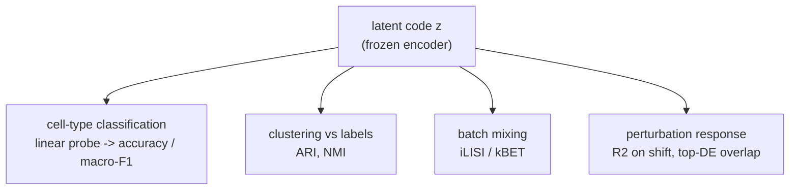

# Chapter 05 — Extrinsic Evaluation: Is the Representation Good *for Something*?

*Stage 5 of the [pipeline](README.md), second half — and where the series finally
reaches the flagship. We stop asking whether the model is good on its own terms and
start asking whether its latent earns its keep on a real task, ending with the
question this whole project exists to answer: can we predict a cell's perturbation
response? Symbols are in the [notation reference](notation.md).*

[Chapter 04](04-intrinsic-evaluation.md) judged the model from the inside, and a
model can pass every one of those checks — crisp reconstructions, healthy
likelihood, active latent, realistic samples — and still hand you a representation
that is useless for the job you actually care about. That gap is the entire reason
extrinsic evaluation exists. **Intrinsic** asked "is the model good on its own
terms?" **Extrinsic** asks the harder, more honest question: "is the learned latent
code $z$ good *for something else*?"

This is also where the warm-up ends. Chapters 01–04 used PBMC — immune cells with
known *types* — because it's forgiving. Here we'll use those same cell-type labels
for the gentle version of the question, then graduate to **Norman 2019 Perturb-seq**
and the flagship version: predicting how a cell responds when you switch a gene on.

## The core idea: a good representation makes hard tasks easy

The premise behind every extrinsic metric is simple. If the encoder has truly
learned the structure of the data, then the latent code $z$ should make downstream
tasks *easy* — the meaningful factors of variation (which cell type, which
perturbation) should be sitting right there in $z$, ready to read off. If instead
$z$ is a tangle, downstream tasks stay hard no matter what you do.

The cleanest way to test this is the **linear probe**. Freeze the trained encoder so
$z$ can't change, then train the *simplest possible* model — a linear classifier
(logistic regression) — to predict a label from $z$. The probe being simple is the
whole point: if even a linear model can read cell type out of $z$, the information is
not just present but *linearly accessible*, the gold standard for a representation.
(Contrast this with *fine-tuning*, where you'd unfreeze the encoder and let it keep
learning during the downstream task. Fine-tuning can rescue a mediocre
representation by quietly fixing it on the way, which is exactly why it's a poor
*test* of the representation you started with. A linear probe can't cheat that way.)

A "downstream task," then, is any real job we ask the latent to do — classify,
cluster, transfer a label, predict a response — that the VAE was never explicitly
trained for.

## The warm-up: extrinsic tasks on PBMC

The first downstream task is **classification**: can a linear probe on $z$ recover
each cell's type? We report **accuracy** (fraction correct) and, because cell types
are usually imbalanced — some are rare — **macro-F1**, which averages the F1 score
across types so a model can't coast by nailing only the common ones. (F1 is the
harmonic mean of precision and recall for a class; macro-F1 averages it evenly over
classes.) The honest version of this number always compares against a baseline. The
natural baseline is **PCA**: take the same number of principal components as the
latent has dimensions and probe *those*. If the VAE latent doesn't beat plain PCA at
the same dimensionality, the VAE hasn't earned its complexity for this task.

The second task is **clustering**: cluster the cells in latent space (with Leiden or
k-means, ignoring the labels) and ask how well the discovered clusters line up with
the known cell types. Two standard scores capture the agreement. The **Adjusted Rand
Index (ARI)** measures how often pairs of cells that share a true type also land in
the same cluster, *adjusted for chance* so that random clusterings score near 0 and
a perfect match scores 1. **Normalized Mutual Information (NMI)** instead measures
how much knowing a cell's cluster tells you about its true type, normalized to
$[0, 1]$. Both reward a latent whose geometry mirrors biology.

The third task matters specifically for real data: **batch mixing**. Single-cell
data is collected in batches, and a good *biological* latent should wash out the
technical batch differences (cells from different runs should intermingle) while
keeping the biology separate. Metrics like **iLISI** and **kBET** quantify whether a
cell's neighbors in latent space come from a healthy mix of batches. The subtlety —
and it's a genuine tension — is that batch mixing and biological separation pull
against each other: mix too aggressively and you blur cell types too. The aggregate
**scIB** benchmark exists precisely to score both at once and force the trade-off
into the open.

A worked read on PBMC makes the comparison concrete. Suppose a linear probe on our
10-dimensional `CVAE_NB` latent reaches about 0.92 macro-F1 on held-out cells, while
a probe on the top 10 principal components reaches about 0.88 — the VAE latent is
modestly but genuinely more linearly separable by cell type. Clustering tells a
similar story: Leiden on the latent scores around ARI 0.78 against the known types,
versus about 0.71 for PCA. The verdict that read supports is that the latent isn't
just internally healthy (Chapter 04) but *useful* — it has organized cells by
biology in a way a simpler method doesn't quite match. That's the bar a
representation has to clear, and now we raise it.

## The flagship: predicting perturbation response

Everything so far was rehearsal. The question this project is built around is the
one we can finally ask: given a cell, **predict how it responds to a genetic
perturbation** — and do it for perturbations the model can't simply have memorized.

Recall the counterfactual machinery from the [notation](notation.md), now with the
condition $c$ carrying its real meaning. A perturbation experiment gives us *control*
cells (unperturbed) and *perturbed* cells (some gene switched on, recorded as the
condition $c$). Our conditional decoder $p_\theta(x \mid z, c)$ was trained to
reconstruct cells given their latent state *and* their perturbation. To *predict*,
we run it as a counterfactual: take a control cell, encode it to its latent state
$z$, then decode under a *new* perturbation $c'$ the cell never actually received.
The output is the model's guess at how that very cell would have responded.

What we evaluate is the **response**, not the raw expression — and this distinction
is everything. Most of a perturbed cell's expression is just... a cell; predicting it
well is easy and unimpressive (copy the control and you're most of the way there).
The hard, meaningful part is the *shift*: for each gene $g$, the change
$\Delta_g = \text{mean}(\text{perturbed}) - \text{mean}(\text{control})$ that the
perturbation caused. So the headline metric is the $R^2$ between the true and
predicted per-gene shifts,

$$
R^2 = 1 - \frac{\sum_g (\Delta_g^{\text{true}} - \Delta_g^{\text{pred}})^2}{\sum_g (\Delta_g^{\text{true}} - \overline{\Delta^{\text{true}}})^2}
$$

where the sum runs over genes $g$, $\Delta_g^{\text{true}}$ and
$\Delta_g^{\text{pred}}$ are the true and predicted shifts, and
$\overline{\Delta^{\text{true}}}$ is the mean true shift. An $R^2$ of 1 means the
predicted shifts match perfectly; an $R^2$ of 0 means the model does no better than
predicting "the average perturbation does the average thing." Measuring $R^2$ on the
*shift* rather than on raw expression is what stops a lazy model from looking good.

Two more checks make the evaluation trustworthy. The **top-DE-gene overlap** asks a
biologist's question: of the genes that *actually* change most under the perturbation
(the top **differentially expressed** genes — those with the largest, most
significant shifts), how many appear in the model's own top-ranked predictions? It's
reported as an overlap or Jaccard score, and it rewards getting the *important* genes
right rather than the average gene. And the deciding discipline is **held-out
perturbations**: leave entire perturbations out of training and predict them at test.
A model that only does well on perturbations it saw in training has memorized, not
understood; the one that generalizes to unseen perturbations is the one worth having.

Norman 2019 makes possible the most demanding test of all. Its experiment includes
not just single-gene activations but **pairs** — gene A and gene B perturbed
together — which is what lets us probe **genetic interactions**: does perturbing A
and B together do something *more than* (or different from) the sum of doing each
alone? The stringent challenge is to train on the singles and predict the *doubles*,
asking whether the model has captured the non-additive biology of how genes
interact, not just learned to add two effects. Getting that right is the difference
between a curve-fitter and a model that has learned something about the system.

## A worked read on the flagship

Here is the kind of read this evaluation produces — illustrative numbers for a
`CVAE_NB` with perturbation conditioning on Norman 2019, framed as what you'd look
for rather than a logged result. On *held-out single* perturbations the per-gene
shift comes back with an $R^2$ around 0.6 and a top-20 DE-gene overlap of roughly
14 of 20 — the model recovers most of the direction and the genes that matter,
without having seen those perturbations in training. On the harder *double*
perturbations predicted from singles, the $R^2$ drops to around 0.45 but still
captures clear synergy on the interacting pairs — partial, but real, evidence that
the latent encodes more than additive effects.

The honest reading of those numbers leans on the failure modes from
[Chapter 04a](04a-evaluation-metrics-worked.md). A high mean-shift $R^2$ with a poor
top-DE overlap would mean the model nails the bulk trend but misses the specific
genes a biologist cares about. And mode collapse — generating only the most common
response regardless of $c$ — would quietly inflate the *average* metrics while
destroying the model's actual usefulness, which is exactly why we check coverage
(top-DE overlap, held-out generalization) and not just a single aggregate score. A
good perturbation read is several numbers that agree, not one that looks impressive
alone.

## Recap, and what's next

Extrinsic evaluation asks whether the latent is good *for a task*, and the cleanest
probe is a **linear** one on a **frozen** encoder — if a simple model can read the
answer out of $z$, the representation has truly captured it. On the PBMC warm-up that
meant cell-type classification (accuracy, macro-F1, always against a PCA baseline),
clustering agreement (ARI, NMI), and batch mixing (with its built-in tension against
biological separation). On the flagship it means **perturbation-response
prediction**: encode a control cell, decode under a new perturbation, and score the
predicted *shift* — $R^2$ on the per-gene change, top-DE-gene overlap, generalization
to **held-out perturbations**, and the Norman 2019 showcase of predicting **double**
perturbations from singles. Throughout, the discipline is to trust several agreeing
numbers over one impressive one, and to watch for mode collapse hiding behind a good
average.

*Next: [Chapter 06 — The Evaluation Protocol](06-evaluation-protocol.md): putting
intrinsic and extrinsic together into a single checklist and one fully worked
end-to-end evaluation — from a trained model to a defensible verdict.*
