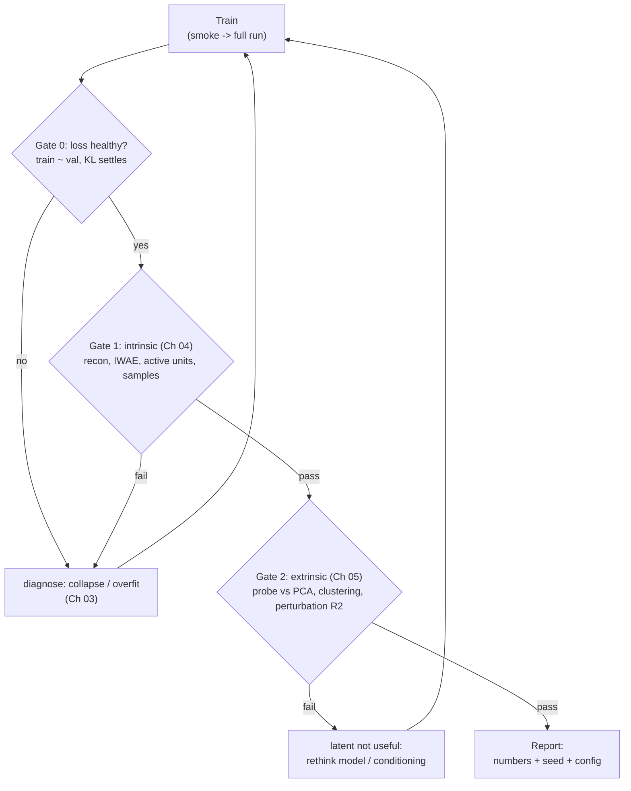

# Chapter 06 — The Evaluation Protocol: From a Trained Model to a Verdict

*The capstone of the [series](README.md). We have the pieces — training diagnostics,
intrinsic metrics, extrinsic tasks — and here we assemble them into one repeatable
protocol, then run it end to end on the PBMC model so you can see a verdict reached.
Symbols are in the [notation reference](notation.md).*

Scattered metrics don't make an evaluation; a *protocol* does. Over the last three
chapters we collected a lot of instruments — reconstruction error and held-out
likelihood and active units ([Chapter 04](04-intrinsic-evaluation.md)), the worked
mechanics of each metric ([Chapter 04a](04a-evaluation-metrics-worked.md)), linear
probes and clustering and perturbation prediction
([Chapter 05](05-extrinsic-evaluation.md)). What's missing is the *order* you apply
them in, the thresholds at which you stop and fix something, and the discipline of
recording it all so the verdict is reproducible. That's this chapter.

The organizing idea is a sequence of **gates**. Each gate is a question you must pass
before the next one is worth asking, and failing a gate sends you back to fix
something rather than forward to fool yourself. Cheap checks come first; expensive,
meaningful ones come last.

## The protocol, gate by gate

**Gate 0 — train and sanity-check.** Before any metric, confirm the run is even
trustworthy. The smoke configuration should pass end to end (the pipeline runs, every
metric computes, artifacts are written — [Chapter 03](03-the-training-loop.md)), and
the full run's loss curve should look healthy: total loss falling, reconstruction
improving, KL rising off the floor and *settling* rather than collapsing to zero, and
train tracking validation. A run that fails here isn't ready to evaluate; it's ready
to debug.

**Gate 1 — intrinsic evaluation.** Now ask whether the model is good on its own
terms, cheapest checks first. Reconstruction NLL on held-out cells should be close to
the training value (generalizing, not memorizing). The active-unit count should be
comfortably above 1 (the latent is being used — this is the posterior-collapse
tripwire). The held-out IWAE should be as high as you can get it. And the generated
cells should carry the real statistical fingerprint — per-gene mean and variance
agreement, and a distribution distance (MMD, or Fréchet-in-PCA) that's small.
Failing Gate 1 usually means collapse or underfitting, which sends you back to
training, not forward to the probe.

**Gate 2 — extrinsic evaluation.** Only a model that's internally healthy earns the
expensive question: is the latent *useful*? Run a linear probe on the frozen encoder
and — crucially — compare it against a PCA baseline at the same dimensionality; a
latent that doesn't beat PCA hasn't earned its complexity. Check clustering agreement
(ARI, NMI) against known labels. And for the flagship, run the real test:
perturbation-response prediction — $R^2$ on the per-gene shift, top-DE-gene overlap,
generalization to *held-out* perturbations, and the doubles-from-singles interaction
challenge. Failing Gate 2 is the subtle, important failure: a model that is internally
perfect yet produces a useless representation, which points not at training but at the
*model* — the latent dimension, the conditioning, the architecture.

**Report.** Passing the gates is not the end; recording is. Log every number
alongside the **seed** (numpy, torch, Python), the **size preset / config**, and the
**data version**, so the verdict can be reproduced and compared against the next
model. An unreproducible good result is a rumor, not a finding.

## Red flags and what they mean

The gates tell you *whether* something is wrong; this table helps you read *what*.

| Symptom | Likely cause | Action |
|---------|--------------|--------|
| KL near zero and flat | posterior collapse | lower β / anneal / free bits ([Chapter 03](03-the-training-loop.md)) |
| Train loss far below val loss | overfitting | regularize, more data, earlier stopping |
| Good reconstruction, probe ≈ PCA or worse | uninformative latent — the classic VAE trap | check active units; rethink latent dim / conditioning |
| High mean-shift R², low top-DE overlap | captures the bulk trend, misses the genes that matter | inspect per-gene; check DE ranking |
| Strong averages, weak coverage / recall | mode collapse | check precision/recall and sample diversity ([Chapter 04a](04a-evaluation-metrics-worked.md)) |

The third row is the one this whole series exists to prevent: a beautiful loss curve
and crisp reconstructions hiding a latent that carries nothing. Intrinsic checks alone
would pass it; only the extrinsic gate catches it.

## A fully worked evaluation: the PBMC model

Let's run the protocol start to finish on our `CVAE_NB` (latent dimension 10) and
reach an actual verdict. The numbers are the illustrative reads we've built up across
the series, now assembled into one decision.

At **Gate 0**, the smoke configuration passes end to end, and the full run's curve is
the healthy one from Chapter 03: reconstruction falling from about 0.84 to 0.27, KL
climbing from roughly 0.05 to 0.32 and settling there, train and validation
descending together. No collapse, no overfitting — proceed.

At **Gate 1**, the held-out reconstruction NLL comes back around 0.27 per cell, right
at the training value, so the model generalizes its reconstructions. The latent shows
6 of 10 active units — well clear of collapse and consistent with that settled KL.
Generated cells, sampled from the prior and decoded, scatter along the diagonal
against the real per-gene means at a correlation near 0.97, with the mean–variance
relationship preserved (the NB decoder reproducing overdispersion rather than
flattening to Poisson). The model is good on its own terms — proceed.

At **Gate 2**, a linear probe on the latent reaches about 0.92 macro-F1 on held-out
cell types, against roughly 0.88 for a 10-component PCA baseline, and Leiden
clustering on the latent scores about ARI 0.78 versus 0.71 for PCA. The latent is
modestly but genuinely more useful than the simpler baseline. (PBMC carries no
perturbations, so the perturbation-prediction sub-gate is exactly where the flagship
takes over — see below.)

**Verdict:** this model passes all three gates. It trains cleanly, it's internally
healthy, and its latent is demonstrably useful for the downstream task — a
representation worth building on. Recorded with its seed, config, and data version,
that verdict is reproducible and comparable, which is the whole point.

## Where this becomes code, and where it goes next

The instruments in this protocol live in
[`src/genailab/eval/`](../../../src/genailab/eval/) — `metrics.py` for the scores,
`diagnostics.py` for active units and collapse checks, `plotting.py` for the scatters
— and the runnable, size-configurable companions to this series
(`examples/vae/training/`, `notebooks/vae/training/`) are designed to execute the
whole gated protocol with one command at smoke or realistic scale.

And the same protocol *is* the flagship evaluation. Swap the PBMC warm-up for **Norman
2019 Perturb-seq**, let the condition $c$ become the perturbation, and Gate 2's
perturbation sub-gate becomes the headline result: held-out single-perturbation
$R^2$, top-DE overlap, and the doubles-from-singles interaction test from
[Chapter 05](05-extrinsic-evaluation.md). Nothing about the protocol changes — only
the dataset and the stakes. That continuity is the payoff of having learned to
evaluate on something gentle first.

## Recap, and the series in one breath

Evaluation is a *gated protocol*, not a pile of numbers: sanity-check the run
(**Gate 0**), confirm the model is good on its own terms (**Gate 1 — intrinsic**),
then confirm its latent is good for a task (**Gate 2 — extrinsic**), and record
everything with seed and config so the verdict reproduces. Read red flags for what
they mean, and never let a pretty loss curve substitute for the extrinsic gate.

Looking back across the whole series: we framed training as a five-stage pipeline
(**01**), saw why the Gaussian posterior is the pragmatic default and what lies beyond
it (**01a**), prepared count data without destroying its structure (**02**), ran and
read the training loop including posterior collapse (**03**), judged the model
intrinsically and reckoned honestly with FID (**04**, **04a**), put the latent to work
on real tasks up to perturbation prediction (**05**), and assembled it all into this
protocol (**06**). Throughout, one perturbation-response storyline tied the notation
together, and one discipline recurred at every stage: a model is only as trustworthy
as the evaluation you're willing to run on it.

*Where to go next: apply this protocol to the flagship in the
[perturbation prediction application](../../applications/perturbation_prediction.md),
and run the gates yourself with the series' [notebooks and scripts](README.md#runnable-companions).*
