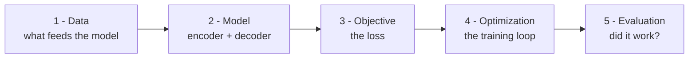

# Training and Evaluating VAEs

A teaching-first series on how to **train** a Variational Autoencoder and, just
as importantly, how to **know whether it worked**.

The companion [VAE theory series](../README.md) (`VAE-01` through `VAE-09`)
answers *what a VAE is and why the math holds together*. This series answers a
different, more practical question: **given a dataset and a VAE, how do you take
it from random weights to a trained, trustworthy model — and how do you measure
"trustworthy"?**

You do not need to have read the whole theory series first. We recap every idea
we lean on as it comes up. If you know what a neural network is, what a loss
function is, and what gradient descent does, you have enough to start.

---

## What this series covers

The journey of training a model has five stages, and each chapter is one stage:

| Chapter | Title | The question it answers |
|---------|-------|-------------------------|
| [01](01-introduction.md) | Introduction | What does "training a VAE" actually mean, end to end? |
| [01a](01a-richer-posteriors.md) | Richer posteriors *(optional aside)* | Why is the posterior a Gaussian — could it be a mixture, Gamma, or something richer? |
| [02](02-datasets.md) | Datasets | What does the training data look like — and do diffusion and flow-matching models want the same data? |
| [03](03-the-training-loop.md) | The training loop | How does the loop run, and how do I read its output and spot trouble? |
| [04](04-intrinsic-evaluation.md) | Intrinsic evaluation | Is the model good *on its own terms*? (And is FID the right metric here?) |
| [04a](04a-evaluation-metrics-worked.md) | Metrics worked *(optional aside)* | Each evaluation metric by hand — CV example, then translated to cells |
| [05](05-extrinsic-evaluation.md) | Extrinsic evaluation | Is the learned representation *useful for downstream tasks*? |
| [06](06-evaluation-protocol.md) | Evaluation protocol | Put it all together: a checklist and one fully worked example. |

---

## The mission, and the running example

The whole series is pointed at one goal — the project's flagship application:
**predict how a cell responds to a genetic perturbation** (switch a gene on and
ask what the cell does) without running every experiment at the bench. Because a
VAE is *generative*, the same model can answer counterfactuals — what would *this*
cell have done under a perturbation we never tried? That mission is what ties the
notation together (see the [notation reference](notation.md)), and it's why we use
a *conditional* VAE: the condition is the perturbation.

We get there in two stages, so the on-ramp stays gentle. Chapters 01–03 **warm up
on PBMC** — a simpler dataset of immune cells with known *types* and no
perturbation — using a conditional VAE with a Negative-Binomial decoder
(`CVAE_NB`) to learn the training mechanics on something forgiving. Chapters 04–06
**graduate to Norman 2019 Perturb-seq**, where the condition becomes the
perturbation and evaluation asks the real question: did we predict held-out
responses?

Don't worry if "Negative-Binomial decoder," "PBMC," or "Perturb-seq" mean nothing
yet — each is introduced gently when it first matters. The point is that every
abstract idea in this series is also shown happening to one concrete, evolving
example.

---

## Runnable companions

Reading explains; running convinces. Each chapter has runnable counterparts that
follow the same parallel layout used across the project:

- **Scripts**: `examples/vae/training/` — production-style, config-driven `.py`.
- **Notebooks**: `notebooks/vae/training/` — step-by-step `.ipynb` walkthroughs.

Everything is **size-configurable**. The exact same code runs as a fast
`smoke` test on your laptop (seconds, CPU — just to prove the workflow is
wired correctly) or as a `realistic` training run on a GPU pod (via `ops/`).
You change a config value, not the code. [Chapter 03](03-the-training-loop.md) explains this pattern in
full.

---

## Prerequisites and pointers

- If a piece of VAE theory feels too compressed here, the deeper derivation is
  in the theory series — we link to the specific chapter each time (for example,
  the ELBO in [VAE-02](../VAE-02-elbo.md), the reparameterization trick in
  [VAE-04](../VAE-04-reparameterization.md), and count decoders in
  [VAE-07](../VAE-07-NB-ZINB.md)).
- Start at [Chapter 01](01-introduction.md) and read in order; each chapter
  recaps what the previous one established before moving on.
