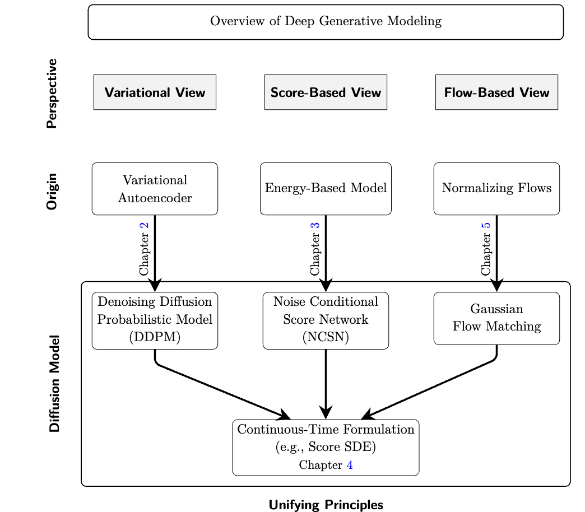

# The Historical Development of Diffusion Models

This document traces the historical development of diffusion models, clarifying the relationship between DDPM, score-based models, and the SDE formulation. Understanding this history helps explain why there are multiple "views" of diffusion models and how they relate to each other.

## Overview Diagram



*Figure: The three perspectives on generative modeling (Variational, Score-Based, Flow-Based) and their convergence to diffusion models through continuous-time formulation.*

---

## The Core Question

Was DDPM derived by discretizing an SDE, or did the SDE view come later?

**Short answer**:

> DDPM was developed first from the variational / discrete-time view. The SDE view came later and unified DDPM with score-based and flow-based models.

But this one sentence hides a very instructive story about how scientific understanding evolves.

---

## 1. The Historical Timeline

DDPM did **not** start from SDEs. Here's what actually happened:

### 2005–2007: Score Matching & Energy-Based Models

- **Hyvärinen**: Introduced score matching
- **Focus**: Learning energy-based models without computing partition functions
- **No diffusion yet**

### 2011: Denoising Score Matching

- **Vincent**: Noise-conditioned score learning
- **Key idea**: Learn to denoise at multiple noise levels
- **Still discrete noise scales**

### 2020: DDPM (Ho et al.)

- **Introduced as**: A discrete-time latent variable model
- **Explicitly framed as**:
  - A Markov chain
  - Trained via variational bound (ELBO)
- **No SDEs in the original paper**

### 2019–2020: NCSN (Song & Ermon)

- **Explicit score-based generative modeling**
- **Sampling**: Langevin dynamics
- **Still discrete noise scales**

### 2021: Score-Based SDEs (Song et al.)

- **Continuous-time formulation**
- **Unified**: DDPM, NCSN, and flow-based models
- **Introduced**: VP-SDE, VE-SDE, probability-flow ODE

### Historical Truth

- **DDPM was not derived by discretizing an SDE**
- It was **later shown** to be equivalent to a particular SDE discretization
- This is a **retrospective unification**, not the original derivation

---

## 2. What DDPM Originally Was

### A Variational Latent Variable Model

In the original DDPM formulation:

**Forward process** (corruption):

$$
q(x_{1:T} \mid x_0) = \prod_{t=1}^T q(x_t \mid x_{t-1})
$$

with Gaussian transitions.

**Reverse process** (generation):

$$
p_\theta(x_{0:T}) = p(x_T) \prod_{t=1}^T p_\theta(x_{t-1} \mid x_t)
$$

**Training objective**:

- Maximize an ELBO (Evidence Lower BOund)
- Equivalent to minimizing KL divergence between forward and reverse chains

### Purely Discrete

This formulation is **purely discrete**:

- No $dt$
- No Brownian motion
- No SDE language

That's why DDPM originally lived in the **variational view**.

---

## 3. Where the Score-Based View Emerges

Even though DDPM was **presented** as variational, something interesting happened:

### The Optimal Reverse Mean

The optimal reverse mean depends on:

$$
\nabla_x \log q(x_t \mid x_0)
$$

Which is a **score** — the gradient of log density.

### The Final Loss

The training loss simplifies to:

$$
\mathbb{E}_{t, x_0, \epsilon} \left[\|\epsilon_\theta(x_t, t) - \epsilon\|^2\right]
$$

This is **MSE on noise**, which is equivalent to score matching.

### Recognition, Not Assumption

The DDPM paper later notes:

> "DDPM training is equivalent to noise-conditional score matching."

But this equivalence was **recognized**, not assumed from the start.

### Two Paths, Same Destination

- **DDPM**: Accidentally learned a score (via variational inference)
- **NCSN**: Explicitly learned a score (via score matching)

Same object, different lens.

---

## 4. How the SDE View Enters

### A Unification, Not an Origin

The SDE view answers a different question:

> "What happens if we let the number of diffusion steps go to infinity?"

### The Continuous Limit

When you take the DDPM forward process:

$$
x_t = \sqrt{\alpha_t} x_{t-1} + \sqrt{1 - \alpha_t} \varepsilon_t
$$

and let:

- Step size → 0
- Number of steps → ∞

You recover the **VP-SDE** (Variance-Preserving SDE):

$$
dx = -\frac{1}{2}\beta(t) x\,dt + \sqrt{\beta(t)}\,dw
$$

### The Key Insight

This is a **continuous-time limit** of DDPM — not its starting point.

**Therefore**:

- DDPM ≈ Euler–Maruyama discretization of VP-SDE
- But historically, **DDPM came first**
- The SDE view **explains** DDPM; it didn't generate it

### Why This Matters

The SDE view is a **unifying mathematical framework** that reveals what all diffusion models are really doing.

---

## 5. Three Views, One Framework

Let's align them **conceptually**, not historically:

### Variational View

| Aspect | Description |
|--------|-------------|
| **Focus** | Likelihood, ELBO, KL divergence |
| **Natural for** | DDPM |
| **Representation** | Discrete latent variables |
| **Emphasis** | Training stability |

### Score-Based View

| Aspect | Description |
|--------|-------------|
| **Focus** | Score function $\nabla_x \log p_t(x)$ |
| **Natural for** | NCSN |
| **Sampling** | Langevin dynamics / reverse SDE |
| **Emphasis** | Geometric interpretation |

### Flow-Based View

| Aspect | Description |
|--------|-------------|
| **Focus** | Deterministic transformations |
| **Natural for** | Probability-flow ODE |
| **Properties** | Exact likelihoods, efficient sampling |
| **Emphasis** | Deterministic generation |

### SDE View: The Umbrella

The SDE view is **not a fourth model**. It's a **continuous mathematical umbrella** that shows all three are the same object:

> Learning a time-dependent vector field that transports probability mass

**The unification**:

- DDPM, NCSN, and Flow Matching all **converge** to the continuous-time formulation
- The SDE view reveals their common structure
- Different views emphasize different aspects of the same underlying process

---

## 6. The Clean Mental Model

Here is the simplest way to think about it:

> **DDPM is a discrete algorithm that happens to be a numerical solver for a particular SDE.**

The SDE:

- Was **not** the design motivation
- But **is** the correct mathematical abstraction

### This Pattern Is Common in Science

| Example | Discrete/Practical | Continuous/Theoretical |
|---------|-------------------|------------------------|
| Calculus | Euler's method | Differential equations |
| Physics | Thermodynamics | Statistical mechanics |
| Optimization | SGD | Stochastic differential equations |
| **Diffusion** | **DDPM** | **VP-SDE** |

In each case, the practical algorithm came first, and the continuous theory provided deeper understanding later.

---

## 7. Summary

### The Historical Facts

1. **DDPM was developed independently** as a discrete-time variational model (2020)
2. **The SDE view came later** (2021) and showed that DDPM, NCSN, and flow-based models are continuous-time limits of the same underlying process
3. DDPM can now be understood as an **Euler–Maruyama discretization of the VP-SDE**, but that is a retrospective unification

### Why the SDE Framework Matters

The SDE framework is powerful because it reveals what all diffusion models are **really doing**:

> Learning a time-dependent score field that reverses a noise-driven probability flow

### The Three Views

```
Variational View (DDPM)  ──┐
                           │
Score-Based View (NCSN)  ──┼──> SDE Formulation
                           │
Flow-Based View (ODE)    ──┘
```

All three views describe the same underlying mathematical object, just from different perspectives.

---

## Next Steps

To deepen understanding:

1. **Derive DDPM from VP-SDE**: See the discrete algorithm emerge from continuous theory
2. **Study the probability-flow ODE**: Understand deterministic sampling
3. **Compare VP-SDE and VE-SDE**: Different noise schedules, same framework

---

## References

- Ho et al. (2020) - "Denoising Diffusion Probabilistic Models" (DDPM)
- Song & Ermon (2019) - "Generative Modeling by Estimating Gradients of the Data Distribution" (NCSN)
- Song et al. (2021) - "Score-Based Generative Modeling through Stochastic Differential Equations"
- Hyvärinen (2005) - "Estimation of Non-Normalized Statistical Models by Score Matching"
- Vincent (2011) - "A Connection Between Score Matching and Denoising Autoencoders"

---

## Related Documents

### SDE View
- [SDE View Overview](../../SDE/01_diffusion_sde_view.md)
- [DDPM to VP-SDE (Continuous Limit)](../../SDE/02c_ddpm_to_vpsde.md)
- [SDE and DDPM](../../SDE/02_sde_and_ddpm.md)

### DDPM View
- [DDPM Foundations](../../DDPM/01_ddpm_foundations.md)
- [DDPM README](../../DDPM/README.md)

### Extensions
- [Classifier-Free Guidance](../classifier_free_guidance.md)
